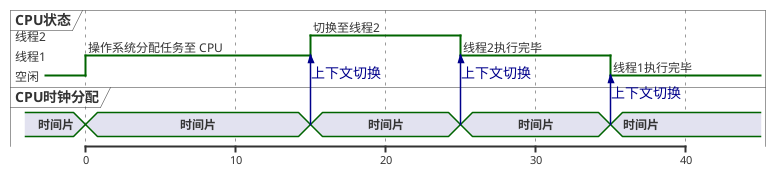
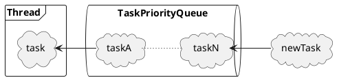
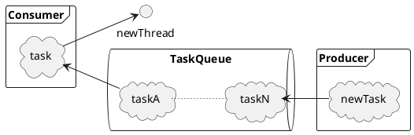
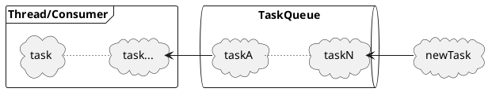
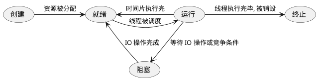
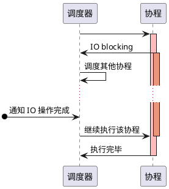

# 序言
在上回 [Python异步初探-协程的定义](/posts/2019/10/14/python异步初探-协程的定义.html) 里，我们探讨了协程的本质，明确了**协程本身并未解决异步编程的问题**，而是提供了一套**由用户主动分配CPU时钟**的可行方案。通过恰当的调度   
接下来，本文将会从任务调度入手，探讨 Python 借助协程实现异步的细节。

# 多线程的任务调度
**线程** 是操作系统进行CPU分配和调度的单位，如果我们需要进行异步编程，首先想到的必然是多线程模型，只需要几行代码，就能启动线程执行异步任务。
```python
import threading
import time


def task(task_id):
    start_clock = time.process_time()
    print(f"task<{task_id}> start")
    # 模拟阻塞
    time.sleep(10)
    print(f"task<{task_id}> end, cost cpu time: {time.process_time() - start_clock}")

for i in range(5):
    threading.Thread(target=task, args=(i, )).start()
```

上面的代码是 Python 多线程异步编程的样例，接下来我们来分析多线程任务执行的顺序。
## 操作系统调度
当启动一个线程时，线程并非立即执行，而是在等待操作系统的资源调度。当线程被分配到CPU时钟时，线程才真正开始执行。

> CPU能执行那个线程，是通过操作系统设置的调度策略而决定的，如果感兴趣可以阅读操作系统相关的书籍，这里就不展开了。

继续讨论回我们上面给的样例，如果我们重复执行几次这个样例, 就会发现, 多线程任务的调度策略和启动顺序是无关的，在重复执行多次还能发现，每次任务调度的顺序也是无关的。
```bash
# 第一次执行的输出结果
task<0> start
task<1> start
task<2> start
task<3> start
task<4> start
## 这里等待了 10 秒
task<0> end, cost cpu time: 0.000682000000000002
task<4> end, cost cpu time: 0.0003599999999999992
task<3> end, cost cpu time: 0.0005119999999999986
task<2> end, cost cpu time: 0.0005790000000000031
task<1> end, cost cpu time: 0.0006910000000000041

# 第二次执行的输出结果
task<0> start
task<1> start
task<2> start
task<3> start
task<4> start
## 这里等待了 10 秒
task<0> end, cost cpu time: 0.0005179999999999976
task<2> end, cost cpu time: 0.0005100000000000035
task<3> end, cost cpu time: 0.00044700000000000295
task<1> end, cost cpu time: 0.0006960000000000022
task<4> end, cost cpu time: 0.0003809999999999994
```
由于多线程的任务调度是由操作系统底层的调度算法决定的，导致 **用户无法决定线程被分配的CPU时间片大小和各线程的执行顺序**。   

## 任务队列-控制线程任务执行顺序的方案
针对控制线程执行顺序的需求，事实上就是要在用户态模拟操作系统针对线程的调度算法，最直观的实现方案就是用**优先队列**将异步任务缓冲起来，再由用户程序**按任务优先级排序**，调度器只需依序执行即可。这种类型的异步任务执行模型如下:


虽然这个模型在设计上满足需求的，但是在编程实现时又引入了新问题: **何时创建线程执行异步任务？**   
如果是在创建异步任务时，马上创建新的线程执行任务，那么这个模型和原来的原地创建线程并未任何本质差异，因此不可能同时创建任务和创建线程。   
通过分析这个模型可以发现，这是典型的生产者消费者模式，只要生产者(推送任务到队列)和消费者(创建新线程执行任务)分别在两个不同的线程运行，那就可以“避免”同时创建任务和创建线程的问题了，调整后的模型如下：

对应的实现代码也很简单: 
```python
def consumer(queue):
    while: True
        task, args, kwargs = queue.get()    
        threading.Thread(target=task, args=args, kwargs=kwargs).start()
        time.sleep(some_preset_threshold)
```
通过将原来的异步任务执行模型改造成上图所示的生产者消费者模式后，看似解决了创建线程的问题，但是再仔细分析新的模型，可以发现消费者的消费速率会始终高于生产者创建异步任务的速率（因为消费者的任务只是创建新的线程），这导致在新的模型中，仍然有很大概率出现同时创建任务和创建线程的问题。   

方案设计仿佛又回到了原点，通过引入队列解决了任务执行优先级的问题，但是并未解决创建线程执行任务的时机。
## 明确消费者的责任
让我们重新回顾最初的异步任务执行模型，我们使用优先队列实现任务缓冲池，再创建新的线程执行其中的任务。其实我们只是需要消费者从队列中取出任务，并将其执行，也就是消费者就是执行任务的线程。


对应的实现代码也很简单: 
::: tip
事实上, 这也是一个简单的线程池化的实现。
:::
```python
def consumer(queue):
    while: True
        task, args, kwargs = queue.get()    
        task(*args, **kwargs)
```
至此，我们就可以通过组合 **优先队列** 和 **线程池** 来简单实现**任务执行顺序可控的多线程调度系统**。接下来，我们探讨如何将此与**协程**结合，实现所谓的异步编程系统。

# 协程的任务调度系统
在上回 [Python异步初探-协程的定义](/posts/2019/10/14/python异步初探-协程的定义.html) 里，我们介绍了 Python 主要通过 **yield**/**send** 两个原语实现了对虚拟机栈帧的保存和复原，属于*非对称式协程*，接下来我们将重点放在**如何实现协程的异步系统**。

## 任务调度系统设计的关键点
我们知道，协程又被称为用户态线程，只有当一个协程主动让出 CPU 的使用权，另一个协程才会被执行。要实现协程的异步系统，首先就必须明确一个问题：**如何切换协程的执行**？   
从任务维度出发，这个问题可以拆解为以下几点:
- 何时让出 CPU？
- CPU 让给了谁？
- 如何继续执行？

### 控制权转移的时机
协程的最佳使用场景是IO密集型的应用，当需要等待 IO 操作执行时，协程可以主动让出 CPU 的使用权，避免浪费 CPU 资源。因此，协程应该在需要等待其他资源执行的地方主动让出 CPU，用伪代码描述如下:
```python
def co():
    result = yield one_blocking()
    handle(result)
    result = yield the_other_blocking()
    handle(result)
```

### 任务的调度器
在上回 [Python异步初探-协程的定义](/posts/2019/10/14/python异步初探-协程的定义.html#协程的官方实现介绍) 里，我们讲解了**非对称式协程**的执行顺序：非对称式协程通过 `send` 原语将控制权转移至子协程(被调用者)，再通过 `yeild` 原语将控制权返回到其父协程(调用者)。
因此，协程的异步系统需要一个调度器负责接收子协程让渡出去的控制权，再从任务队列中挑选合适的协程继续执行。与此同时，这个调度器还需要保证只有当需要等待的 IO 操作执行完毕后，才继续执行上一个协程，用伪代码描述如下:
```python
def scheduler():
    while True:
        co = task_queue.get()
        ret = co.send()
        if ret is some_blocking:
            task_queue.put(ret.bind(co))
```
### 基于回调的事件处理机制
我们知道，一个线程的生命周期可能会在5个状态中轮转， 分别是创建，就绪，运行，阻塞，终止，这几种关系的状态转移关系入下图所示:

对于多线程而言，由于任务调度是委托至操作系统完成的，程序无需关心线程被阻塞后的执行情况。   
但是对于协程调度系统而言，如果其中一个协程被阻塞，就意味着整个系统都被阻塞，只有当阻塞操作完成后，协程系统才会继续运行下去。
阻塞对整个协程系统是毁灭性的，所有协程都只允许使用非阻塞 IO 操作，同时在调用 IO 操作后，需要马上让渡出 CPU 的使用权给调度器，当调度器判断 IO操作完成后，再继续执行该协程。

对于网络IO、磁盘IO等调用，操作系统均提供了异步读写的系统调用(system call)。一般而言，异步 IO 调用会返回文件描述符（句柄），用户程序只需要调用操作系统提供的 API，就可以知道 IO 操作是否完成。
::: tip
并非所有阻塞操作都和系统调用有关, 也许协程只希望等待几秒钟再执行, 那么这类型阻塞操作完成与否的判断就必须由协程异步系统来实现，这部分内容后面再说。
:::

简而言之，只需要在调度器中增加判断 IO 操作是否执行完毕的操作即可，用伪代码描述如下:

```python
def scheduler():
    while True:
        co = queue.get()
        ret = co.send()
        if ret is some_blocking:
            queue.put(ret.bind(co))
        if ret is io_operation:
            register_io_operation(ret)

        ops = get_completed_io_operations()
        for op in ops:
            ret = op.send()
            if ret is some_blocking:
                queue.put(ret.bind(co))
            if ret is io_operation:
                register_io_operation(ret)
```

### 延迟执行协议

### 事件循环机制
当引入非阻塞IO的概念后，调度器的逻辑变得复杂，我们需要合适的编程模型来重构我们的调度器，事件循环

# 总结
在这篇文章里，我们首先围绕着**多线程的任务调度**这一话题，从底层的操作系统调度多线程的原理出发，逐步深入探讨在用户态控制多线程任务执行顺序的方案的设计和实现，总结出基于**优先队列缓冲池**可以实现控制用户态