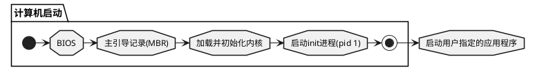
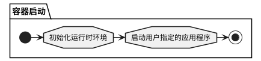

# 前言
现在是容器化时代，不管是开发、测试还是运维，很少有人会不知道或不会用 Docker。使用 Docker 也很简单，很多时候启动容器无非就是执行 `docker run {your-image-name}`，而构建镜像也就是执行一句 `docker build dockerfile .`的事情。   
也许正是由于 **Docker** 对实现细节封装得过于彻底，有时候会觉得我们也许只是学会了**如何使用`Docker CLI`** , 而并非明白 Docker 是如何运行的。   
笔者将在『How To Build Images』系列文章讲述 `Docker build dockerfile .`相关的实现细节，本文是本系列的第二篇文章，将为各位展示从 0 开始徒手构建 Docker 镜像的相关知识。   
> 注: 本文假设读者了解如何使用 Docker, 包括但不限于懂得执行 `docker run` 和 `docker build` 以及编写 Dockerfile，还需要懂得 [Docker 镜像规范](http://blog.shabbywu.cn/posts/2021/01/31/how-to-build-images-docker-%E9%95%9C%E5%83%8F%E8%A7%84%E8%8C%83.html)

# 剖玄析微-原来容器是这样运行的
## Docker 架构简述
在讲解构建镜像之前, 不得不先了解 Docker 是如何将镜像转换成容器的。在 Docker1.11 之后, Docker 的架构图迭代为下图的模式:


如图所示，Docker 将运行时拆分成两个模块, 分别是 **containerd** 和 **runc**。这两者都是容器技术标准化之后的产物，其中 **containerd** 负责管理镜像和容器相关的网络设施等上层建筑，而 **runc** 则专注于容器化技术实现以及容器管理等底层设施。   

我们平常执行 `docker run` 指令需要经历: *Docker Cli* 与 *Docker Engine* 通信, *Docker Engine* 将请求解析后再转发至 *containerd*, 最后 *containerd* 借助 *containerd-shim* 这个转换器调用 *runc*, 容器才真正被创建和运行。   

照这么说，我们可不可以砍掉中间商, 直接调用 `runc` 来创建容器呢？答案是可以的。我们只需要根据 **OCI 运行时规范** 将容器编排为文件系统捆绑包(Filesystem Bundle)的形式，即可使用 `runc` 启动该容器。
> 注1: 对于 linux 系统, 一般安装 Docker 即会同时安装 runc, 如本机未安装 runc, 可直接在 github 下载预编译好的 [runc 二进制文件](https://github.com/opencontainers/runc/releases)。   
> 注2: 想进一步了解 **OCI 运行时规范** 的读者, 可以阅读笔者另一个系列文章[『How To Run Container:OCI 运行时规范』](http://blog.shabbywu.cn/posts/2021/03/31/how-to-run-container-oci-%E8%BF%90%E8%A1%8C%E6%97%B6%E8%A7%84%E8%8C%83.html)

## runc-如何运行一个容器镜像

根据 **OCI 运行时规范**, 一个基本的容器应该具备以下的文件目录结构:
```bash
.
├── config.json
└── $root.path
```
> 其中, 通常将 `$root.path`  设置为 **rootfs**。

首先我们创建一个空目录用于编排容器捆绑包。

```bash
➜ cd /some-path
# 创建捆绑包目录
➜ mkdir mycontainer && cd mycontainer

# 创建 rootfs 目录
➜ mkdir rootfs
```

接下来的步骤则是生成 `config.json` 文件。由于OCI 运行时规范很复杂, 手工配置 config.json 需要花费很大的精力。不过幸好，runc 已经预留了特殊指令方便生成基本规范模板。

```bash
# 生成基本模板
➜ runc spec
```

虽然我们还没往容器根文件系统里塞东西, 但是我们不妨试试容器能不能跑起来，万一能跑起来呢？

```bash
➜ runc run mycontainer
# ERRO[0000] container_linux.go:349: starting container process caused "exec: \"sh\": executable file not found in $PATH"
# container_linux.go:349: starting container process caused "exec: \"sh\": executable file not found in $PATH"
```

预料之内地出现了报错..., 毕竟我们容器什么都没有，又怎么能跑起来呢。   
现在到了最后一步也是最重要的一步, 那就是创建容器根文件系统的内容。但是我们压根不知道容器内应该有什么内容...怎么办好呢？那就从 Docker 中导出一个容器来看看应该长什么样子呗！

```bash
# 导出
➜ docker export $(docker create --rm --name busybox busybox) | tar -C rootfs -xvf - && docker stop busybox && docker rm busybox

# 确定 rootfs 内容
➜ ls rootfs
bin  dev  etc  home  proc  root  sys  tmp  usr  var

# 执行
➜ runc run mycontainer

# 在容器内执行 ls 、hostname 和 whoami
➜ ls
bin   dev   etc   home  proc  root  sys   tmp   usr   var

➜ hostname
runc

➜ whoami
root
```

小结一下, 想要直接运行容器十分简单, 只需要:
1. 将容器编排为文件系统捆绑包(Filesystem Bundle)的形式
2. 往 `config.json` 编写正确的配置
3. 往 `$root.path` 填充合理和可用的文件
4. 执行 runc run $containerid

# 照猫画虎-构建可运行的容器捆绑包
我们在上一节借助了 Docker 导出了可运行的容器的根文件系统，那如果不借助外力，我们有没有可能创建一个简单的可运行的容器呢？答案是可以的，但是在此之前需要先复习容器相关的知识。

## 容器和虚拟机的区别
虚拟机是一种运行在主机操作系统(HostOS)之上，可以访问底层硬件的客机操作系统(GuestOS)，例如 Linux 或 Windows；而容器是轻量级应用代码包，它还包含依赖项，例如编程语言运行时的特定版本和运行软件服务所需的库。与虚拟机相似，容器为用户提供了独立环境来运行应用程序，但两者具有本质上的差异:
- 容器在操作系统级别进行虚拟, 而虚拟机在硬件级别进行虚拟化
- 容器与主机操作系统(HostOS)共享操作系统内核, 而虚拟机使用客机操作系统(GuestOS)提供的操作系统内核。


容器与虚拟机架构的差异带来的优势想必已经被说烂了，这里我也不会再说什么。我们将关注点放在**启动**这个流程。

### 虚拟机的启动流程
由于虚拟机是在硬件级别进行虚拟化，虚拟机的启动流程也即是计算机的启动流程。完整的计算机启动流程至少包括了 4 个阶段:


### 容器的启动流程
由于容器与主机共享操作系统内核, 启动容器只包含 2 个阶段:


虚拟机与容器的启动流程最大的差异在于, 在`启动用户指定的应用程序`之前, 虚拟机需要先执行`计算机启动`这一流程, 而容器在`初始化运行时环境`后, 即马上启动用户指定的应用程序。这导致在容器中所看到的的 **pid 1** 进程, 即为 **用户指定的应用程序**。   
另一方面, 由于容器启动无需经历`加载并初始化内核`和`启动init进程`这两个阶段, 因此容器镜像中无需包含操作系统内核和init进程等成分。   
终上所述, 创建一个简单的可运行的容器只需要准备用户指定的应用程序和它的依赖项即可，无需任何多余成分。

## 一个极其简单的可执行程序
在这一小节里, 我们主要的任务是创建一个简单的可执行程序，那什么样的可执行程序是最简单的呢？正所谓万法归宗, 最简单的程序必然是汇编。这里预先准备了一段用 nasm 写的汇编程序，如下:

```nasm
section .data
     msg:     db   "Hello runc!", 13, 10; 10 为ASCII码：\n(LF)，13ASCII码：\r(CR)
     msglen:  equ  $ - msg;

section .text
     global _start 

_start:
     mov eax, 4        ; 4 对应 sys_write 系统调用
     mov ebx, 1        ; sys_write 系统调用第一个参数: 文件描述符, 1 即标准输出
     mov ecx, msg      ; sys_write 系统调用第二个参数: 要输出的字符串的偏移地址
     mov edx, msglen   ; sys_write 系统调用第三个参数: 字符串长度
     int 80h           ; 80h中断，触发系统调用

     mov eax, 1   ; 1 对应 exit 系统调用
     mov ebx, 0   ; exit 系统调用参数: 返回码
     int 80h      ; 80h中断，触发系统调用
```

nasm 汇编语言的组成成分这里就不展开介绍，现在只需要编译、链接即可生成可执行程序。

```bash
# 我们目前还在 mycontainer 目录, 将上面的代码输出到 hello.nasm 文件
# 使用 nasm 编译 hello.nasm, 注意设置输出格式为 ELF64 (x86-64) (Linux, most Unix variants)
➜ nasm hello.nasm -f elf64 -o hello.o

# 链接, 将目标文件连接为可执行程序
➜ ld hello.o -o hello

# 测试运行
➜ ./hello
Hello runc!
```

通过上述操作, 我们现在已经获得到一个可以在 x86-64 架构的 Linux 平台下执行的无依赖的可执行文件，我们现在尝试将其放到容器内执行。

```bash
# 先清空 rootfs 目录
➜ rm -r -f rootfs && mkdir rootfs

# 将 hello 文件复制至 rootfs 目录内
➜ cp hello rootfs/

# 确定 rootfs 目录仅有 hello 文件
➜ ls -la rootfs
总用量 12
drwxr-xr-x 2 root root 4096 4月   8 20:40 .
drwxr-xr-x 3 root root 4096 4月   8 20:40 ..
-rwxr-xr-x 1 root root 1040 4月   8 20:40 hello

# 启动容器!
➜ runc run mycontainer
ERRO[0000] container_linux.go:367: starting container process caused: exec: "sh": executable file not found in $PATH
```

然后就毫无意外地报错了...   
根据错误信息, 默认的运行时配置模板指定的启动程序是 `sh` , 但是由于我们的容器极其简洁, 连 `sh` 程序都没有, 所以就报错了。我们只需要将 **process.args** 修改成 `/hello` 即可。

```bash
# 将 "sh" 替换成 "/hello"
➜ sed -i "s/\"sh\"/\"\/hello\"/" config.json

# 启动容器!
➜ runc run mycontainer
Hello runc!
```

小结一下, 想要从 0 开始构建可运行的容器十分简单, 只需要:
1. 将容器编排为文件系统捆绑包(Filesystem Bundle)的形式
2. 往 `$root.path` 中添加用户指定的应用程序和它的依赖项
3. 保证 `config.json` 中的 **process.args** 指定的指令在容器中是可执行的
4. 执行 runc run $containerid


# 门前一脚-封装镜像归档包
我们在上一节中照猫画虎地构建了一个极其简单的可执行的容器，那有没有办法将这个容器打包成镜像, 并导入到 Docker 里呢？答案是可以的，而且凭借我们目前掌握的知识点，已足以实现这个需求。先让我们复习一下 Docker 镜像归档包的基本目录结构。

```bash
.
├── 036a82c6d65f2fa43a13599661490be3fca1c3d6790814668d4e8c0213153b12
│   ├── VERSION
│   ├── json
│   └── layer.tar
├── 6ad733544a6317992a6fac4eb19fe1df577d4dec7529efec28a5bd0edad0fd30.json
├── manifest.json
└── repositories

1 directory, 6 files
```

其中只有 `manifest.json` 中声明的要素是镜像归档包的必要成分，其他文件都无需关注。也就是说, 只需要关注 `layer.tar`, `config.json` 以及 `manifest.json` 三个文件。
> 注1: config.json 即 Image JSON, 在归档包中常以自身的 sha256sum 命名, 在上述案例中即 `6ad733544a6317992a6fac4eb19fe1df577d4dec7529efec28a5bd0edad0fd30.json`
> 注2: 容器镜像归档包中包含的成分和含义详见本系列上一篇文章[『How To Build Images:Docker 镜像规范 v1.2』](http://blog.shabbywu.cn/posts/2021/01/31/how-to-build-images-docker-%E9%95%9C%E5%83%8F%E8%A7%84%E8%8C%83.html)

## 构建 layer.tar
层归档包记录着镜像内容的变更历史, 我们这个镜像包有且只有一层, 因此只需要将 hello 文件打包进归档包即可。

```bash
# 我们目前还在 mycontainer 目录
# 创建层归档包 layer.tar
➜ tar -cf layer.tar -C rootfs hello

# 验证归档包内容
➜ tar -tvf layer.tar
-rwxr-xr-x root/root      1040 2021-04-08 20:40 hello

# 计算 layer.tar 的 sha256sum 备用
➜ sha256sum layer.tar
45f29debe3c1db5d78d29583a12cb58208ca1942b23e281e9c5894182b5ffb97  layer.tar
```

## 构建 config.json
Image JSON 包含了与镜像相关的基本信息和运行时的相关配置等, 这导致构建 config.json 是最为复杂的步骤。为了减少这小节所占用篇幅, 这里直接展示构建结果, 并在注释中描述关键数据的来源。
```json
{
	"architecture": "amd64",
    // 从 runc 生成的 config.json 的 process 字段里抄
	"config": {
    // 镜像并没有创建用户, 所以这里留空
		"User": "",
		"Tty": false,
		"Env": ["PATH=/usr/local/sbin:/usr/local/bin:/usr/sbin:/usr/bin:/sbin:/bin"],
        // 启动指令, 这里设置为 /hello, 与 runc 的配置一致
		"Cmd": ["/hello"],
		"Volumes": null,
		"WorkingDir": "/",
		"Entrypoint": null,
        "Labels": null
	},
    // created 描述了当前镜像创建的日期和时间  
	"created": "1970-01-01T00:00:00.0Z",
    // 构建镜像的 docker 版本号, 由于是手工构建, 我们执行 `docker version` 抄一下版本号
	"docker_version": "20.10.5",
    // 没有构建 docker build 历史
	"history": [],
	"os": "linux",
	"rootfs": {
		"type": "layers",
		"diff_ids": 
        // 这里是 layer.tar 的 sha256sum
        ["sha256:45f29debe3c1db5d78d29583a12cb58208ca1942b23e281e9c5894182b5ffb97"]
	}
}
```

将上述配置压缩(去掉注释)后, 计算压缩后的内容的 sha256sum, 并命名为对应的 ${sha256sum}.json
> 上述配置对应的 sha256sum 为 112e38209f1b62794b83d25708b5ab354792a8155453d151aac8dadca11e2c48


## 构建 manifest.json
`mainfest.json` 记录了一个列表, 该列表中每一项描述了一个镜像的内容清单以及该镜像的父镜像(可选的)。我们的镜像不存在父镜像, 因此只需要记录一个结构即可。具体的配置如下:

```json
[
  {
    "Config": "112e38209f1b62794b83d25708b5ab354792a8155453d151aac8dadca11e2c48.json",
    "RepoTags": [
      "hello-runc:nasm"
    ],
    "Layers": [
      "layer.tar"
    ]
  }
]
```

## 归档封包
将上述的文件放置到同一层的目录进, 使用 tar 打包归档即可。
```bash
# 我们目前还在 mycontainer 目录
# 保证上述文件都在 mycontainer 目录内
➜ ls 
112e38209f1b62794b83d25708b5ab354792a8155453d151aac8dadca11e2c48.json  config.json  layer.tar  manifest.json  rootfs

# 打包归档
➜ tar -cf image.tar 112e38209f1b62794b83d25708b5ab354792a8155453d151aac8dadca11e2c48.json layer.tar manifest.json

# 验证归档包内容
➜  tar -tvf image.tar
-rw-r--r-- root/root       417 2021-04-08 22:14 112e38209f1b62794b83d25708b5ab354792a8155453d151aac8dadca11e2c48.json
-rw-r--r-- root/root     10240 2021-04-08 22:14 layer.tar
-rw-r--r-- root/root       188 2021-04-08 22:14 manifest.json
```

## 导入镜像
docker 导入镜像十分简单, 只需要执行 `docker load` 指令即可。接下来即演示导入镜像的操作。

```bash
# 我们目前还在 mycontainer 目录
# 保证容器原先不存在 hello-runc 镜像
➜ docker images hello-runc
REPOSITORY   TAG       IMAGE ID   CREATED   SIZE

# 执行指令导入镜像
➜ docker load -i image.tar
Loaded image: hello-runc:nasm

# 验证镜像已存在
➜ docker images hello-runc
REPOSITORY   TAG       IMAGE ID       CREATED        SIZE
hello-runc   nasm      112e38209f1b   51 years ago   1.04kB
```

到目前为止, 我们已徒手构建 Docker 镜像, 并成功导入到 Docker 镜像列表中。为了彰显成功的喜悦，将验证环节放到下一节进行。我们现在小结一下，想要徒手构建 Docker 镜像十分简单, 只需要:
1. 将容器编排为文件系统捆绑包(Filesystem Bundle)的形式
2. 将容器文件系统捆绑包打包成 layer.tar 文件
3. 依照容器运行时配置内容(runc 的 config.json), 编写镜像配置信息(Image JSON, 镜像的 config.json)
4. 编写容器清单文件 (manifest.json)
5. tar打包归档成镜像

# 大功告成-创建容器运行验证结果与总结
我们在上一节中徒手构建了 Docker 镜像并成功将其导入到 Docker 镜像列表中，我们将在这一环节浓重地使用该镜像创建容器😁

```bash
# 我们目前还在 mycontainer 目录, 但这并不重要。
# 使用默认参数创建容器
➜ docker run --rm hello-runc:nasm
WARNING: IPv4 forwarding is disabled. Networking will not work.
Hello runc!

# 通过指定启动指令的形式创建容器
➜ docker run --rm hello-runc:nasm /hello
WARNING: IPv4 forwarding is disabled. Networking will not work.
Hello runc!
```

至此, 我们已经从 0 开始徒手构建 Docker 镜像, 并成功将其导入 Docker 镜像列表并正常运行。证实了徒手构建 Docker 镜像的可能性。   
最后我们总结一下, 构建 Docker 镜像十分简单, 只需要:
1. 熟悉 Docker 镜像规范
2. 准备容器运行环境, 即应用程序及其依赖项，例如编程语言运行时的特定版本和运行软件服务所需的库
3. 整理镜像各层的归档包(layer.tar), 并计算 Layer DiffID
4. 依照规范编写镜像配置信息(Image JSON), 并计算 ImageID
5. 编写容器清单文件 (manifest.json)
6. tar打包归档成镜像

这篇文章是『How To Build Images』系列的第二篇，主要以 runc 如何运行容器为切入点, 深入介绍了构建 Docker 镜像的各个步骤和实现细节，到这里为止，我们已经初步掌握了 **How To Build Images** 的知识，本系列的下一篇文章将带大家深入 Docker(moby) 的实现细节, 为大家剖析 `docker build dockerfile .` 背后被隐藏的细节。<sub>~~净听你吹牛逼~~</sub>

---

# 附录
## 最小的镜像-没有之一
我们在这篇文章构建了一个大小只有 **1.04kB** 的可运行的容器, 那么有没有办法构建比这更小的容器呢？答案是肯定的, 那就是 Docker 官方提供的 **scratch** 镜像, 这个镜像完全不包含任何东西，而且**正常途径**是无法下载该镜像的。

```bash
➜ docker pull scratch
Using default tag: latest
Error response from daemon: 'scratch' is a reserved name
```

虽然通过正常途径无法 pull **scratch** 镜像, 但是 docker 官方提供了构建该镜像的方法:

```bash
➜ tar cv --files-from /dev/null | docker import - scratch
sha256:12973c2ef51625eb40e47970903b97629f9942ba03a087b73c4f2afc520a3757
```

执行上述指令后, 就可以在镜像列表里找到一个 0 字节的镜像啦~

```bash
➜ docker images
REPOSITORY         TAG       IMAGE ID       CREATED         SIZE
scratch            latest    72a1f559e368   2 seconds ago   0B
```