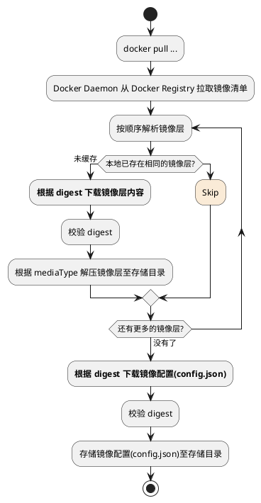
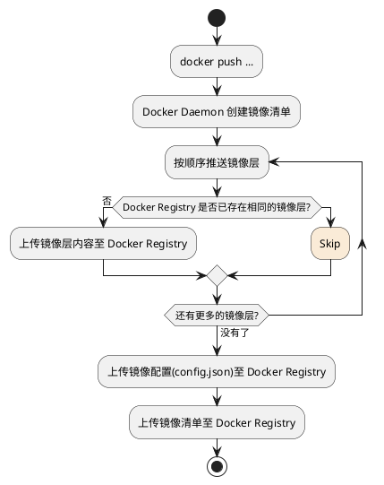

# 前言
现在是容器化时代，不管是开发、测试还是运维，很少有人会不知道或不会用 Docker。使用 Docker 也很简单，很多时候启动容器无非就是执行 `docker run {your-image-name}`，而构建镜像也就是执行一句 `docker build dockerfile .`的事情。   
也许正是由于 **Docker** 对实现细节封装得过于彻底，有时候会觉得我们也许只是学会了**如何使用`Docker CLI`** , 而并非明白 Docker 是如何运行的。   
笔者将在『How To Build Images』系列文章讲述 `Docker build dockerfile .`相关的实现细节，本文是本系列的第三篇文章，将为各位介绍 Docker Daemon 与 Docker Registry 的交互流程和实现细节。

# Docker Daemon 与 Docker Registry 的关系
我们平时使用的 `docker` 命令称之为 `Docker Cli`。`Docker Cli` 为用户提供了在命令行中操作镜像、容器、网络和数据卷的相关指令, 但事实上真正操作相应资源实体的进程是 `Docker Daemon`。   
`Docker` 使用的是典型的 C/S 架构, `Docker Daemon` 则是后台常驻运行的服务端组件, 负责管理宿主机中的所有 Docker 资源以及与其他 Daemon 进行通讯。   
`Docker Registry` 负责存储和分发 Docker 镜像。当我们调用 `docker pull` 和 `docker push` 时, `Docker Daemon` 将从 `Docker Registry` 提取镜像或推送镜像至 `Docker Registry`。


# Docker Daemon 拉取镜像的流程
正如前言, 当在命令行执行 `docker pull` 时, 实际上是让 `Docker Daemon` 往 `Docker Registry` 拉取所需的镜像。在笔者上一篇文章[『从 0 开始带你徒手构建 Docker 镜像』](http://blog.shabbywu.cn/posts/2021/04/01/how-to-build-image-%E4%BB%8E-0-%E5%BC%80%E5%A7%8B%E5%B8%A6%E4%BD%A0%E5%BE%92%E6%89%8B%E6%9E%84%E5%BB%BA-docker-%E9%95%9C%E5%83%8F.html#%E5%BD%92%E6%A1%A3%E5%B0%81%E5%8C%85)曾经展示过构建镜像的过程, 那么镜像是否就是一个包含了 `config.json(镜像配置)`, `manifest.json(镜像清单)`, `layer.tar(镜像层内容)` 的 Tar 归档包呢？

答案是否定的, Docker Registry 在分发镜像时是按镜像层为单元进行分发, 而并非直接分发镜像本身。   
但是这又引入了另一个问题, 在笔者的另一篇文章[『Docker 镜像规范 v1.2』](http://blog.shabbywu.cn/posts/2021/01/31/how-to-build-images-docker-%E9%95%9C%E5%83%8F%E8%A7%84%E8%8C%83.html)描述的镜像都是基于一定的文件目录结构编排的, 如果需要按镜像层进行分发, 那 `Docker Daemon` 是如何知道从哪里下载哪个镜像层呢？

为了解决这个问题, 需要引入另一个概念, `Docker Image Manifest`。

## Docker Image Manifest
`Docker Image Manifest` 不同于 `manifest.json`, 前者是用于描述 `Docker Registry` 中的镜像的清单文件, 而后者是描述导出镜像中内容的清单文件。   

目前 Docker Registry 共支持两个不同格式的 `Docker Image Manifest`, 分别为 [Image Manifest Version 2, Schema 1](https://github.com/distribution/distribution/blob/main/docs/spec/manifest-v2-1.md) 和 [Image Manifest Version 2, Schema 2](https://github.com/distribution/distribution/blob/main/docs/spec/manifest-v2-2.md)。

以下是 Schema 2 的清单样例:
```json
{
    "schemaVersion": 2,
    "mediaType": "application/vnd.docker.distribution.manifest.v2+json",
    "config": {
        "mediaType": "application/vnd.docker.container.image.v1+json",
        "size": 7023,
        "digest": "sha256:b5b2b2c507a0944348e0303114d8d93aaaa081732b86451d9bce1f432a537bc7"
    },
    "layers": [
        {
            "mediaType": "application/vnd.docker.image.rootfs.diff.tar.gzip",
            "size": 32654,
            "digest": "sha256:e692418e4cbaf90ca69d05a66403747baa33ee08806650b51fab815ad7fc331f"
        },
        {
            "mediaType": "application/vnd.docker.image.rootfs.diff.tar.gzip",
            "size": 16724,
            "digest": "sha256:3c3a4604a545cdc127456d94e421cd355bca5b528f4a9c1905b15da2eb4a4c6b"
        },
        {
            "mediaType": "application/vnd.docker.image.rootfs.diff.tar.gzip",
            "size": 73109,
            "digest": "sha256:ec4b8955958665577945c89419d1af06b5f7636b4ac3da7f12184802ad867736"
        }
    ]
}
```
::: tip
值得注意的是, **application/vnd.docker.container.image.v1+json** 对应的类型即是在[『Docker 镜像规范 v1.2』](http://blog.shabbywu.cn/posts/2021/01/31/how-to-build-images-docker-%E9%95%9C%E5%83%8F%E8%A7%84%E8%8C%83.html)中介绍的 `Config`(又被称之为 `Image JSON`)。
:::

## 流程总结

`Docker Registry` 使用 **数字摘要(digest)** 定位镜像层和镜像配置等镜像内容, 而 `Docker Image Manifest` 又描述了镜像配置和镜像层的数字摘要以及相应的文件类型, 最后 `Docker Daemon` 只需要根据清单逐一下载解析即可。   
简而言之, `docker pull` 的流程可概况如下:



# Docker Daemon 推送镜像的流程
推送镜像的工作流程与拉取镜像完全相反。`Docker Daemon` 首先创建镜像清单, 再需要将所有镜像层推送至 `Docker Registry`, 只有当所有镜像层完全推送至镜像仓库后, 再将镜像配置上传至镜像仓库, 最后才推送镜像清单, `docker push` 的流程可概况如下:



# 流程之外但必不可少的步骤: 用户认证
到目前为止, 我们已经完整展示了拉取镜像和推送镜像的操作流程, 但是还有一个至关重要的步骤还未介绍, 那就是**用户认证**。   
Docker Registry 采用中央认证服务实现用户身份认证, 具体的认证流程如下所示:


1. `Docker Daemon` 尝试进行 pull/push 操作
2. 如果 `Docker Registry` 需要进行用户认证, 那么就应该返回 `401 Unauthorized` 的 HTTP 相应, 并在返回头里描述如何进行用户认证(基于 WWW-Authenticate 协议)
3. `Docker Daemon` 向中央认证服务进行用户认证
4. 中央认证服务向 `Docker Daemon` 返回一个 `Bearer token`, 代表用户的身份
5. `Docker Daemon` 重试 **步骤1** 中发送的请求, 并在请求头中带上 **步骤4** 中返回的 `Bearer token`
6. `Docker Registry` 认证请求头中附带的 `Bearer token`, 验证通过后即可正常相应

# 小试牛刀
在笔者上一篇文章[『从 0 开始带你徒手构建 Docker 镜像』](http://blog.shabbywu.cn/posts/2021/04/01/how-to-build-image-%E4%BB%8E-0-%E5%BC%80%E5%A7%8B%E5%B8%A6%E4%BD%A0%E5%BE%92%E6%89%8B%E6%9E%84%E5%BB%BA-docker-%E9%95%9C%E5%83%8F.html#%E5%BD%92%E6%A1%A3%E5%B0%81%E5%8C%85)曾经构建了一个可运行的镜像, 现在我们尝试将该镜像推送至官方的 Docker Registry -- DockerHub。

## 1. 创建镜像清单(Docker Image Manifest)
重新根据上一篇文章记载的流程构建这个镜像, 并在计算 `镜像配置(config.json)` 与 `镜像层 (layer.tar)` 的 sha256 数字摘要后, 即可编写`镜像清单(Docker Image Manifest)`, 得如下所示的 JSON 文件:

```json
{
    "schemaVersion": 2,
    "mediaType": "application/vnd.docker.distribution.manifest.v2+json",
    "config": {
        "mediaType": "application/vnd.docker.container.image.v1+json",
        "size": 546,
        "digest": "sha256:2bd297f395ef7193402fbf58b1010655c7bf27b22c38545a63c71af402f73dc5"
    },
    "layers": [
        {
            "mediaType": "application/vnd.docker.image.rootfs.diff.tar.gzip",
            "size": 10240,
            "digest": "sha256:cc668e407245ebdacbb7ac6d5ead798556adb5aebfcdd7fa2ca777bed3a83fed"
        }
    ]
}
```

## 2. 上传镜像层与镜像配置至 Docker Registry

根据[接口文档](https://github.com/distribution/distribution/blob/main/docs/spec/api.md#monolithic-upload), 我们采用整体上传的方式将镜像层与镜像配置推送至 Docker Registry。

```bash
# 涉及的环境变量:
# - your_username: DockerHub 的账号
# - your_password: DockerHub 账号的密码
# - your_token: 认证接口返回的 token 或 access_token

# 【用户认证】发起上传镜像配置操作
➜ curl -X POST "https://registry.hub.docker.com/v2/${your_username}/runc-hello/blobs/uploads/" -v

# 返回 401 Unauthorized
# < HTTP/1.1 401 Unauthorized
# < docker-distribution-api-version: registry/2.0
# < www-authenticate: Bearer realm="https://auth.docker.io/token",service="registry.docker.io",scope="repository:${your_username}/runc-hello:pull,push"

# 【用户认证】进行用户认证
➜ curl -u "${your_username}:${your_password}" "https://auth.docker.io/token?service=registry.docker.io&scope=repository:${your_username}/runc-hello:pull,push"
# {
#  "token": "...",
#  "access_token": "...",
#  "expires_in": 300,
#  "issued_at": "2021-12-07T01:50:05.654533932Z"
# }

# 【上传镜像配置】重新发起上传镜像配置操作
➜ curl -H "Authorization: Bearer ${your_token}" -X POST "https://registry.hub.docker.com/v2/${your_username}/runc-hello/blobs/uploads/" -v
# < HTTP/1.1 202 Accepted
# < content-length: 0
# < docker-distribution-api-version: registry/2.0
# < docker-upload-uuid: 53231064-74b5-48d5-8cbd-5f810fa99a0c
# < location: https://registry.hub.docker.com/v2/435495971/runc-hello/blobs/uploads/53231064-74b5-48d5-8cbd-5f810fa99a0c?_state=S8Kt2Fx6i-CX-C7j4kS9RahBhxtS5BySKuJoaKup6QJ7Ik5hbWUiOiI0MzU0OTU5NzEvcnVuYy1oZWxsbyIsIlVVSUQiOiI1MzIzMTA2NC03NGI1LTQ4ZDUtOGNiZC01ZjgxMGZhOTlhMGMiLCJPZmZzZXQiOjAsIlN0YXJ0ZWRBdCI6IjIwMjEtMTItMDdUMDI6NDE6MjEuODgwMDcwOTI5WiJ9

# 【上传镜像配置】开始上传镜像配置内容
➜ curl -H "Authorization: Bearer ${your_token}" -X PUT "https://registry.hub.docker.com/v2/${your_username}/runc-hello/blobs/uploads/53231064-74b5-48d5-8cbd-5f810fa99a0c?_state=S8Kt2Fx6i-CX-C7j4kS9RahBhxtS5BySKuJoaKup6QJ7Ik5hbWUiOiI0MzU0OTU5NzEvcnVuYy1oZWxsbyIsIlVVSUQiOiI1MzIzMTA2NC03NGI1LTQ4ZDUtOGNiZC01ZjgxMGZhOTlhMGMiLCJPZmZzZXQiOjAsIlN0YXJ0ZWRBdCI6IjIwMjEtMTItMDdUMDI6NDE6MjEuODgwMDcwOTI5WiJ9&digest=sha256:2bd297f395ef7193402fbf58b1010655c7bf27b22c38545a63c71af402f73dc5" --upload-file config.json -v
# 上传成功, 返回 201
# < HTTP/1.1 201 Created
# < content-length: 0
# < docker-content-digest: sha256:2bd297f395ef7193402fbf58b1010655c7bf27b22c38545a63c71af402f73dc5


# 【上传镜像层】发起上传镜像层操作
➜ curl -H "Authorization: Bearer ${your_token}" -X POST "https://registry.hub.docker.com/v2/${your_username}/runc-hello/blobs/uploads/" -v
# < HTTP/1.1 202 Accepted
# < content-length: 0
# < docker-distribution-api-version: registry/2.0
# < docker-upload-uuid: 34efca43-27ed-4806-a74e-6cbea2d222f2
# < location: https://registry.hub.docker.com/v2/435495971/runc-hello/blobs/uploads/34efca43-27ed-4806-a74e-6cbea2d222f2?_state=O7lkfqKiEF-Ryqhms-_CnCsmd76kDtt_HjuprAebwJN7Ik5hbWUiOiI0MzU0OTU5NzEvcnVuYy1oZWxsbyIsIlVVSUQiOiIzNGVmY2E0My0yN2VkLTQ4MDYtYTc0ZS02Y2JlYTJkMjIyZjIiLCJPZmZzZXQiOjAsIlN0YXJ0ZWRBdCI6IjIwMjEtMTItMDdUMDI6NDY6MzEuNTY2ODMwNjI3WiJ9

# 【上传镜像层】开始上传镜像层内容
➜ curl -H "Authorization: Bearer ${your_token}" -X PUT "https://registry.hub.docker.com/v2/${your_username}/runc-hello/blobs/uploads/34efca43-27ed-4806-a74e-6cbea2d222f2?_state=O7lkfqKiEF-Ryqhms-_CnCsmd76kDtt_HjuprAebwJN7Ik5hbWUiOiI0MzU0OTU5NzEvcnVuYy1oZWxsbyIsIlVVSUQiOiIzNGVmY2E0My0yN2VkLTQ4MDYtYTc0ZS02Y2JlYTJkMjIyZjIiLCJPZmZzZXQiOjAsIlN0YXJ0ZWRBdCI6IjIwMjEtMTItMDdUMDI6NDY6MzEuNTY2ODMwNjI3WiJ9&digest=sha256:cc668e407245ebdacbb7ac6d5ead798556adb5aebfcdd7fa2ca777bed3a83fed" --upload-file layer.tar -v
# 上传成功, 返回 201
# < HTTP/1.1 201 Created
# < content-length: 0
# < docker-content-digest: sha256:cc668e407245ebdacbb7ac6d5ead798556adb5aebfcdd7fa2ca777bed3a83fed
# < docker-distribution-api-version: registry/2.0
# < location: https://registry.hub.docker.com/v2/${your_username}/runc-hello/blobs/sha256:cc668e407245ebdacbb7ac6d5ead798556adb5aebfcdd7fa2ca777bed3a83fed
```

## 3. 上传镜像清单
Docker 官方文档里的样例使用的是 Manifest Schema 1, 包含的内容很复杂, 但事实上用 Schema 2 也同样能创建镜像清单。

```bash
➜ curl -H "Authorization: Bearer ${your_token}" -X PUT "https://registry.hub.docker.com/v2/${your_username}/runc-hello/manifests/latest" -H "Content-Type: application/vnd.docker.distribution.manifest.v2+json" -v -d '{
    "schemaVersion": 2,
    "mediaType": "application/vnd.docker.distribution.manifest.v2+json",
    "config": {
        "mediaType": "application/vnd.docker.container.image.v1+json",
        "size": 546,
        "digest": "sha256:2bd297f395ef7193402fbf58b1010655c7bf27b22c38545a63c71af402f73dc5"
    },
    "layers": [
        {
            "mediaType": "application/vnd.docker.image.rootfs.diff.tar.gzip",
            "size": 10240,
            "digest": "sha256:cc668e407245ebdacbb7ac6d5ead798556adb5aebfcdd7fa2ca777bed3a83fed"
        }
    ]
}'
# 上传成功, 返回 201
# < HTTP/1.1 201 Created
# < docker-content-digest: sha256:c4c42af74cf13c704100d9a7583d106d90f737ffb7dc12593022884986fc41dc
# < docker-distribution-api-version: registry/2.0
# < location: https://registry.hub.docker.com/v2/${your_username}/runc-hello/manifests/sha256:c4c42af74cf13c704100d9a7583d106d90f737ffb7dc12593022884986fc41dc
```

## 4. 验证

```bash
➜ docker pull 435495971/runc-hello:latest
# latest: Pulling from 435495971/runc-hello
# cc668e407245: Pull complete
# Digest: sha256:c4c42af74cf13c704100d9a7583d106d90f737ffb7dc12593022884986fc41dc
# Status: Downloaded newer image for 435495971/runc-hello:latest
# docker.io/435495971/runc-hello:latest

➜ docker run --rm 435495971/runc-hello:latest
Hello runc!
```

# 总结
这篇文章是『How To Build Images』系列的第三篇，首先介绍了 Docker Daemon 与 Docker Registry 之间的关系, 再详细介绍了 `docker pull` 与 `docker push` 背后隐藏的操作细节, 最后以上一篇文章[『从 0 开始带你徒手构建 Docker 镜像』](http://blog.shabbywu.cn/posts/2021/04/01/how-to-build-image-%E4%BB%8E-0-%E5%BC%80%E5%A7%8B%E5%B8%A6%E4%BD%A0%E5%BE%92%E6%89%8B%E6%9E%84%E5%BB%BA-docker-%E9%95%9C%E5%83%8F.html#%E5%BD%92%E6%A1%A3%E5%B0%81%E5%8C%85)曾经构建了一个可运行的镜像为例子, 完整演示了推送镜像至 Dockerhub 的步骤。到目前为止, 我们已经掌握了镜像分发和上传的基本知识, 本系列的下一篇文章将为大家剖析 `docker build dockerfile .` 背后被隐藏的细节, 同时也将介绍 Google 提出的一个在容器内构建镜像的方案(kaniko)。

# 附录
## 手把手教你从 Docker Registry 拉取镜像
由于篇幅问题, 正文的「小试牛刀」环节只展示了推送镜像的操作, 在这里继续介绍 ”拉取镜像“ 涉及的操作。

### 1. 下载镜像清单
在下载镜像清单时, Docker Registry 默认返回的是 `Schema 1`, 如果希望接收 `Schema 2` 版本的 Manifest, 则需要指定 `Accept: application/vnd.docker.distribution.manifest.v2+json`。

```bash
➜ curl -H "Accept: application/vnd.docker.distribution.manifest.v2+json" -H "Authorization: Bearer ${your_token}" "https://registry.hub.docker.com/v2/${your_username}/runc-hello/manifests/latest"
# {
#     "schemaVersion": 2,
#     "mediaType": "application/vnd.docker.distribution.manifest.v2+json",
#     "config": {
#         "mediaType": "application/vnd.docker.container.image.v1+json",
#         "size": 546,
#         "digest": "sha256:2bd297f395ef7193402fbf58b1010655c7bf27b22c38545a63c71af402f73dc5"
#     },
#     "layers": [
#         {
#             "mediaType": "application/vnd.docker.image.rootfs.diff.tar.gzip",
#             "size": 10240,
#             "digest": "sha256:cc668e407245ebdacbb7ac6d5ead798556adb5aebfcdd7fa2ca777bed3a83fed"
#         }
#     ]
# }
```

### 2. 下载镜像配置与镜像层
```bash
# 下载镜像配置
➜ curl -H "Authorization: Bearer ${your_token}" "https://registry.hub.docker.com/v2/${your_username}/runc-hello/blobs/sha256:2bd297f395ef7193402fbf58b1010655c7bf27b22c38545a63c71af402f73dc5" -o 2bd297f395ef7193402fbf58b1010655c7bf27b22c38545a63c71af402f73dc5 -L

# 验证镜像配置
➜ cat 2bd297f395ef7193402fbf58b1010655c7bf27b22c38545a63c71af402f73dc5
{"architecture":"amd64","config":{"User":"","Tty":false,"Env":["PATH=/usr/local/sbin:/usr/local/bin:/usr/sbin:/usr/bin:/sbin:/bin"],"Cmd":["/hello"],"Volumes":null,"WorkingDir":"/","Entrypoint":null,"Labels":null},"created":"1970-01-01T00:00:00.0Z","docker_version":"20.10.5","history":[{"created":"1970-01-01T00:00:00.0Z","created_by":"nasm hello.nasm -f elf64 -o hello.o && ld hello.o -o hello && cp hello /hello"}],"os":"linux","rootfs":{"type":"layers","diff_ids":["sha256:cc668e407245ebdacbb7ac6d5ead798556adb5aebfcdd7fa2ca777bed3a83fed"]}}

# 下载镜像层
➜ curl -H "Authorization: Bearer ${your_token}" "https://registry.hub.docker.com/v2/${your_username}/runc-hello/blobs/sha256:cc668e407245ebdacbb7ac6d5ead798556adb5aebfcdd7fa2ca777bed3a83fed" -o cc668e407245ebdacbb7ac6d5ead798556adb5aebfcdd7fa2ca777bed3a83fed -L

# 验证镜像层
➜ tar -tf cc668e407245ebdacbb7ac6d5ead798556adb5aebfcdd7fa2ca777bed3a83fed
hello
```

### 3. 存储镜像至特定目录
虽然 Docker Registry 的接口简单, 但是 Docker Daemon 本身还需要将对应的文件存储到特定的目录, 具体的流程包括:
- 存储镜像配置至 `graph` 目录下的 `image/${storage_driver}/imagedb/content/sha256/`
- 解压镜像层内容至 `graph` 目录下的 `${storage_driver}/${cache_id}` 和 
- 存储镜像层记录至 `graph` 目录下的 `image/${storage_driver}/layerdb/content/sha256/`
- 记录镜像与标签的关联关系至 `graph` 目录下的 `image/${storage_driver}/repositories.json`

以下演示对应的操作:
```bash
# 提取当前的 graph 路径
➜ graph=`docker info|grep -Eo "Docker Root Dir: .*" | sed -r "s/Docker Root Dir: (.*)/\1/g"`

# 提取 Storage Driver 类型
➜ storage_driver=`docker info|grep -Eo "Storage Driver: .*" | sed -r "s/Storage Driver: (.*)/\1/g"`

# 存储镜像配置
➜ cp 2bd297f395ef7193402fbf58b1010655c7bf27b22c38545a63c71af402f73dc5 "${graph}/image/${storage_driver}/imagedb/content/sha256/2bd297f395ef7193402fbf58b1010655c7bf27b22c38545a63c71af402f73dc5"

# 构建镜像层内容
# 1. 生成随机 cache-id
➜ cache_id=`cat /proc/sys/kernel/random/uuid | md5sum | awk '{print $1}'`
# 2. 创建映射目录
➜ mkdir -p "${graph}/${storage_driver}/${cache_id}"
➜ touch "${graph}/${storage_driver}/${cache_id}/committed"
➜ mkdir "${graph}/${storage_driver}/${cache_id}/diff"
# 3. 解压镜像层至 diff 目录
➜ tar -xf cc668e407245ebdacbb7ac6d5ead798556adb5aebfcdd7fa2ca777bed3a83fed -C "${graph}/${storage_driver}/${cache_id}/diff"
# 4. 生成短 ID (26位长)
➜ lid=`cat /proc/sys/kernel/random/uuid | md5sum | awk '{print substr($1,0,27)}'`
# 5. 创建层映射
➜ ln -s "../${cache_id}/diff" "${graph}/${storage_driver}/l/${lid}" 
# 6. 记录短映射ID
➜ echo -n "$lid" > "${graph}/${storage_driver}/${cache_id}/link"


# 构建镜像层内容(索引)
➜ mkdir -p "${graph}/image/${storage_driver}/layerdb/sha256/cc668e407245ebdacbb7ac6d5ead798556adb5aebfcdd7fa2ca777bed3a83fed"
# 1. 记录 diff-id
➜ echo -n "sha256:cc668e407245ebdacbb7ac6d5ead798556adb5aebfcdd7fa2ca777bed3a83fed" > "${graph}/image/${storage_driver}/layerdb/sha256/cc668e407245ebdacbb7ac6d5ead798556adb5aebfcdd7fa2ca777bed3a83fed/diff"
# 2. 记录镜像层大小
➜ echo -n `stat "${graph}/${storage_driver}/${cache_id}/diff/hello" --printf '%s'` > "${graph}/image/${storage_driver}/layerdb/sha256/cc668e407245ebdacbb7ac6d5ead798556adb5aebfcdd7fa2ca777bed3a83fed/size"
# 3. 记录短映射 ID
➜ echo -n "${cache_id}" > "${graph}/image/${storage_driver}/layerdb/sha256/cc668e407245ebdacbb7ac6d5ead798556adb5aebfcdd7fa2ca777bed3a83fed/cache-id"

# 记录镜像索引
➜ python -c "import json;fh=open('${graph}/image/${storage_driver}/repositories.json');repositories=json.load(fh);repositories['Repositories']['hello-runc']={'hello-runc:latest': 'sha256:2bd297f395ef7193402fbf58b1010655c7bf27b22c38545a63c71af402f73dc5'};print(repositories);fh=open('${graph}/image/${storage_driver}/repositories.json', mode='w');json.dump(repositories, fh);"
```

### 4. 验证
```bash
# 只有重启 Docker Daemon 进程, 镜像才会被正确识别。
➜ docker images
REPOSITORY   TAG       IMAGE ID   CREATED   SIZE

# 重启 Docker Daemon
➜ systemctl restart docker

➜ docker images
REPOSITORY   TAG       IMAGE ID       CREATED        SIZE
hello-runc   latest    2bd297f395ef   51 years ago   1.02kB

➜ docker run --rm hello-runc
Hello runc!
```
