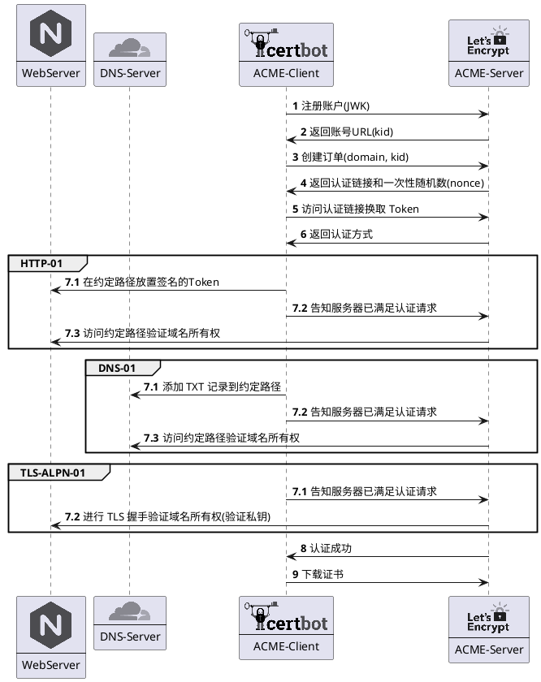

# 前言
为了推动更安全的 HTTPS 加密协议普及全网，谷歌 Chrome 浏览器从 2017 年开始逐步对HTTP网站标记 **“不安全”** 警告，并在 2018年7月24日 发布的 Chrome 68 正式版本中将所有 HTTP 网站标记 **“不安全”**。


随着 Chrome 68 版本的覆盖范围，HTTP网站上的“不安全”警告将被越来越多的Chrome用户看到。因此，使用 HTTPS 加密协议提高网站安全性是每个网站所有者的义务。
但是，为了确保私钥安全，SSL/TLS 证书都设置了有效期限，最新的国际标准中SSL证书最长有效期为2年（825天）。如果网站使用的 SSL 证书已过期，那么 Chrome 反而会出现**红色“不安全”**警告。

.png)

虽然推动 HTTPS 协议的初衷是好的，但是并非所有网站都需要 HTTPS 协议保护(例如你正在访问的静态网站 -- 博客)。为了避免网站被提示不安全，Chrome 68 的策略无疑大幅提高了网站运营人员的工作量 -- **需要定期检查证书的有效性，避免被标记为更吓人的红色“不安全”警告**。

基于上述背景，本文介绍一种解放证书维护的工作量的方法 -- 全自动 Let's Encrypt 证书托管。

# 什么是 Let's Encrypt

Let’s Encrypt 是一家全球性非盈利的证书颁发机构（CA），在全球范围内提供了**免费的域名验证型（DV）证书**。网站所有者可以使用 Let's Encrypt 证书来启用安全的 HTTPS 连接。

# 如何申请 Let's Encrypt 证书

与其他常见的 CA 机构不同, Let's Encrypt 证书是基于 [**ACME(Automatic Certificate Management Environment) 协议**](https://www.rfc-editor.org/rfc/rfc8555) 全自助颁发、续期或吊销的。
一般而言，申请 Let's Encrypt 证书可拆分成 2 个步骤。
- 首先, 向 Let's Encrypt 证明 Web 服务域名的**所有权**。*(与其他 CA 机构一样, 颁发 DV 证书都需要证明域名所有权)*
- 然后, 调用 Let's Encrypt 提供的 API 颁发、续期或吊销该域名的证书。


## Let's Encrypt 的工作原理

Let's Encrypt 通过公私密钥对验证和区分不同的 ACME 客户端的请求。为了认证域名的所有权, ACME 协议目前提出了 3 种域名所有权认证的方式，分别是 `HTTP 01`、`DNS 01` 和 `TLS-ALPN-01`。我们可通过下面的流程图了解域名认证的大致流程。



## 流程演示

我们使用 [acme.sh](https://github.com/acmesh-official/acme.sh) 演示如何通过 `DNS-01` 认证域名所有权，并签发 HTTPS 证书。

### Step 1. 发起域名证书申请请求

```bash
# 启动容器 acme.sh 容器
❯ docker run --rm -it neilpang/acme.sh sh
# 注册账号
❯ acme.sh --register-account -m shabbywu@qq.com --server letsencrypt

Create account key ok.
Registering account: https://acme-v02.api.letsencrypt.org/directory
Registered
ACCOUNT_THUMBPRINT='******'

# 使用手动模式申请域名证书
❯ acme.sh --issue --dns -d test.shabbywu.cn --server letsencrypt --yes-I-know-dns-manual-mode-enough-go-ahead-please

Using CA: https://acme.zerossl.com/v2/DV90
Creating domain key
The domain key is here: /acme.sh/test.shabbywu.cn/test.shabbywu.cn.key
Single domain='test.shabbywu.cn'
Getting domain auth token for each domain
Getting webroot for domain='test.shabbywu.cn'
Add the following TXT record:
Domain: '_acme-challenge.test.shabbywu.cn'
TXT value: 'zvXo7P0nyVh-4AQ_IZyfbqajoKkpaLCku60W80DFCeI'
Please be aware that you prepend _acme-challenge. before your domain
so the resulting subdomain will be: _acme-challenge.test.shabbywu.cn
Please add the TXT records to the domains, and re-run with --renew.
Please add '--debug' or '--log' to check more details.
See: https://github.com/acmesh-official/acme.sh/wiki/How-to-debug-acme.sh
```

### Step 2. 添加 DNS 记录并验证

```bash
# 调用 DNSPOD API 添加 DNS 记录
❯ curl -X POST https://dnsapi.cn/Record.Create -d "login_token=$DP_Id,$DP_Key&format=json&domain=shabbywu.cn&sub_domain=_acme-challenge.test&record_type=TXT&ttl=600&record_line=默认&value=zvXo7P0nyVh-4AQ_IZyfbqajoKkpaLCku60W80DFCeI"
# 验证 DNS 记录
❯ dig -t TXT _acme-challenge.test.shabbywu.cn +short
"zvXo7P0nyVh-4AQ_IZyfbqajoKkpaLCku60W80DFCeI"
```

### Step 3. 获取域名证书

```bash
# 通知 Let's Encrypt 验证域名所有权并下载证书
❯ acme.sh --renew -d test.shabbywu.cn --server letsencrypt --yes-I-know-dns-manual-mode-enough-go-ahead-please

Renew: 'test.shabbywu.cn'
Renew to Le_API=https://acme-v02.api.letsencrypt.org/directory
Using CA: https://acme-v02.api.letsencrypt.org/directory
Single domain='test.shabbywu.cn'
Getting domain auth token for each domain
Verifying: test.shabbywu.cn
Pending, The CA is processing your order, please just wait. (1/30)
Pending, The CA is processing your order, please just wait. (2/30)
Success
Verify finished, start to sign.
Lets finalize the order.
Le_OrderFinalize='https://acme-v02.api.letsencrypt.org/acme/finalize/820949067/143403376067'
Downloading cert.
Le_LinkCert='https://acme-v02.api.letsencrypt.org/acme/cert/03ea91f35baf0a82ffda0d4bffbf2ea76a12'
Cert success.
-----BEGIN CERTIFICATE-----
******
******
-----END CERTIFICATE-----
Your cert is in: /acme.sh/test.shabbywu.cn/test.shabbywu.cn.cer
Your cert key is in: /acme.sh/test.shabbywu.cn/test.shabbywu.cn.key
The intermediate CA cert is in: /acme.sh/test.shabbywu.cn/ca.cer
And the full chain certs is there: /acme.sh/test.shabbywu.cn/fullchain.cer

# [Optional] 调用 DNSPOD API 删除 DNS 记录
❯ curl -X POST https://dnsapi.cn/Record.Remove -d "login_token=$DP_Id,$DP_Key&format=json&domain=shabbywu.cn&record_id=1246824242"

# 验证 HTTPS 证书有效性
## 下载 CA 证书
❯ wget https://letsencrypt.org/certs/lets-encrypt-r3.pem
## 验证证书有效性
❯ openssl verify -CAfile lets-encrypt-r3.pem /acme.sh/test.shabbywu.cn/ca.cer /acme.sh/test.shabbywu.cn/test.shabbywu.cn.cer
```

### Step 4. [Optional]吊销域名证书

```bash
# 吊销证书
❯ acme.sh --remove -d test.shabbywu.cn --server letsencrypt 
```

由于签发的证书量太大，因此 Let's Encrypt 并未提供 CRL(证书吊销列表) 查询功能。也就是说即使吊销了证书，也无法查询到吊销结果😂。

# 全自动托管 Let's Encrypt 证书
ACME 协议使得全自动签发和续签证书成为可能。目前较为热门的 ACME 客户端都提供了全自动托管的配置方式。
以下分别介绍 2 种全自动托管 Let's Encrypt 证书的方式。

## 定时任务 - linux cron

`acme.sh` 是 Bash 上的 ACME 客户端实现，可轻松借助 `linux cron` 定时任务实现证书的定时续期操作。
`acme.sh` 提供了多种方式实现域名自动化认证，不仅可以与 `nginx`, `apache` 等主流 web server 配合自动完成 `HTTP-01` 认证，还提供了不依赖前端 web server 的 `standalone` 模式自动完成域名所有权认证(需要监听端口接受网络请求)。
如果不希望服务器被 `Let's Encrypt` 访问, 亦可以借助 `dnsapi` 自动完成 `DNS-01` 认证。

```bash
# 自动 DNS 认证
❯ acme.sh --issue --dns dns_dp -d test.shabbywu.cn --server letsencrypt 
Using CA: https://acme.zerossl.com/v2/DV90
Create account key ok.
Registering account: https://acme-v02.api.letsencrypt.org/directory
Registered
ACCOUNT_THUMBPRINT='******'
Creating domain key
The domain key is here: /acme.sh/test.shabbywu.cn/test.shabbywu.cn.key
Single domain='test.shabbywu.cn'
Getting domain auth token for each domain
Getting webroot for domain='test.shabbywu.cn'
Adding txt value: TMl-MXa3Wmahajj40mioNb-iiljnTK0XSzUhxNWaulw for domain:  _acme-challenge.test.shabbywu.cn
Adding record
The txt record is added: Success.
Let's check each DNS record now. Sleep 20 seconds first.
You can use '--dnssleep' to disable public dns checks.
See: https://github.com/acmesh-official/acme.sh/wiki/dnscheck
Checking test.shabbywu.cn for _acme-challenge.test.shabbywu.cn
Domain test.shabbywu.cn '_acme-challenge.test.shabbywu.cn' success.
All success, let's return
Verifying: test.shabbywu.cn
Pending, The CA is processing your order, please just wait. (1/30)
Success
Removing DNS records.
Removing txt: TMl-MXa3Wmahajj40mioNb-iiljnTK0XSzUhxNWaulw for domain: _acme-challenge.test.shabbywu.cn
Removed: Success
Verify finished, start to sign.
Lets finalize the order.
Le_OrderFinalize='https://acme-v02.api.letsencrypt.org/acme/finalize/821484497/143530627597'
Downloading cert.
Le_LinkCert='https://acme-v02.api.letsencrypt.org/acme/cert/03fb7dff89b61c4451664ba11f052eec20b2'
Cert success.
-----BEGIN CERTIFICATE-----
******
******
-----END CERTIFICATE-----
Your cert is in: /acme.sh/test.shabbywu.cn/test.shabbywu.cn.cer
Your cert key is in: /acme.sh/test.shabbywu.cn/test.shabbywu.cn.key
The intermediate CA cert is in: /acme.sh/test.shabbywu.cn/ca.cer
And the full chain certs is there: /acme.sh/test.shabbywu.cn/fullchain.cer

# 安装定时任务脚本
❯ acme.sh --install-cronjob
Installing cron job
21 0 * * * "/root/.acme.sh"/acme.sh --cron --home "/root/.acme.sh" --config-home "/acme.sh"

# 验证定时任务
❯ crontab -l
21 0 * * * "/root/.acme.sh"/acme.sh --cron --home "/root/.acme.sh" --config-home "/acme.sh"
```

## 使用集成 ACME 的网关 - traefik

使用 `acme.sh` 自动签发的证书仍然需要挂载到 Web 服务器(服务网关) 才能正确处理 HTTPS 请求。如果不依赖服务网关提供的额外特性(例如 nginx lua 等), 我们不妨考虑一些集成了 ACME 的网关，例如 traefik。

### Docker

`traefik` 支持使用 labels 为 Docker 容器注入路由配置，以下是一份开启了 `ACME` 配置的 `docker-compose` 样例。

```yaml
version: "3.3"
services:
  traefik:
    image: "traefik:v2.9"
    container_name: "traefik"
    command:
      - "--api.insecure=true"
      - "--providers.docker=true"
      - "--providers.docker.exposedbydefault=false"
      - "--entrypoints.web.address=:80"
      - "--entrypoints.websecure.address=:443"
      - "--certificatesresolvers.myresolver.acme.dnschallenge=true"
      # 使用腾讯云 API 完成 DNS-01 认证
      - "--certificatesresolvers.myresolver.acme.dnschallenge.provider=tencentcloud"
      - "--certificatesresolvers.myresolver.acme.email=postmaster@example.com"
      - "--certificatesresolvers.myresolver.acme.storage=/letsencrypt/acme.json"
    ports:
      - "80:80"
      - "443:443"
      - "8080:8080"
    environment:
    # 腾讯云 API 的配置
      - "TENCENTCLOUD_SECRET_ID=xxx"
      - "TENCENTCLOUD_SECRET_KEY=xxx"
    volumes:
      - "./letsencrypt:/letsencrypt"
      - "/var/run/docker.sock:/var/run/docker.sock:ro"
  whoami:
    image: "traefik/whoami"
    container_name: "simple-service"
    labels:
      - "traefik.enable=true"
      - "traefik.http.routers.whoami.rule=Host(`whoami.example.com`)"
      - "traefik.http.routers.whoami.entrypoints=websecure"
      # 指定 tls 证书供应商为 myresolver
      - "traefik.http.routers.whoami.tls.certresolver=myresolver"
```

### K8S
`traefik` 同时支持 [**K8s Ingress**](https://doc.traefik.io/traefik/providers/kubernetes-ingress/) 或者 [**IngressRoute(CRD)**](https://doc.traefik.io/traefik/providers/kubernetes-crd/) 进行路由配置。

```yaml
# Ingress 配置样例
apiVersion: networking.k8s.io/v1
kind: Ingress
metadata:
  name: whoami-ingress
  annotations:
    # 声明 traefik 路由入口, 默认配置下的 websecure 是 443 端口
    traefik.ingress.kubernetes.io/router.entrypoints: websecure
    # 声明开启 tls
    traefik.ingress.kubernetes.io/router.tls: "true"
    # 声明 tls 证书供应商
    traefik.ingress.kubernetes.io/router.tls.certresolver: myresolver
spec:
  rules:
    - host: your.example.com
      http:
        paths:
          - path: /tls
            pathType: Exact
            backend:
              service:
                name:  whoami
                port:
                  number: 80
---
# IngressRoute 配置样例
apiVersion: traefik.containo.us/v1alpha1
kind: IngressRoute
metadata:
  name: simpleingressroute
  namespace: default
spec:
  entryPoints:
    - web
  routes:
  - match: Host(`your.example.com`) && PathPrefix(`/notls`)
    kind: Rule
    services:
    - name: whoami
      port: 80

---
apiVersion: traefik.containo.us/v1alpha1
kind: IngressRoute
metadata:
  name: ingressroutetls
  namespace: default
spec:
  entryPoints:
    - websecure
  routes:
  - match: Host(`your.example.com`) && PathPrefix(`/tls`)
    kind: Rule
    services:
    - name: whoami
      port: 80
  # 声明开合 tls 和 tls 证书供应商
  tls:
    certResolver: myresolver
```