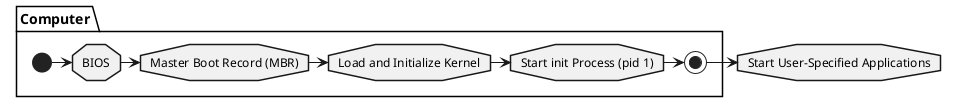
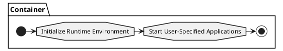

## Preface
We are now in the era of containerization, where hardly anyone in development, testing, or operations would be unfamiliar with or unable to use Docker. Using Docker is also straightforward; most of the time, launching a container simply involves executing `docker run {your-image-name}`, and building an image is as simple as executing `docker build dockerfile .`.   
Perhaps it's precisely because Docker encapsulates implementation details so thoroughly that I recently realized that we may have only learned **how to use Docker CLI**, rather than understanding how Docker actually operates.   
In the **『How To Build Images』** series, I will discuss the implementation details related to `Docker build dockerfile .`. This article is the second installment of this series and will demonstrate the knowledge required to build Docker images from scratch.
> Note: This article assumes that readers know how to use Docker, including but not limited to knowing how to execute `docker run` and `docker build` and writing a Dockerfile. Additionally, readers should be familiar with the [Docker Image Specification](/en/posts/2021/01/31/how-to-build-images-docker-%E9%95%9C%E5%83%8F%E8%A7%84%E8%8C%83.html).


## Exploring the Depths - How Containers Actually Run
### Overview of Docker Architecture
Before delving into building images, it's essential to understand how Docker transforms images into containers. Starting from Docker 1.11, the architecture of Docker evolved into the following model:


As shown in the diagram, Docker splits the runtime into two modules, namely **containerd** and **runc**. Both of these are products of container technology standardization. **Containerd** is responsible for higher-level functionalities such as image management and networking infrastructure, while **runc** focuses on lower-level functionalities like container management and containerization technology.

When we execute `docker run` command, it goes through the following steps: *Docker CLI* communicates with *Docker Engine*, which then parses the request and forwards it to *containerd*. Finally, *containerd*, with the help of *containerd-shim* as a converter, invokes *runc* to create and run the container.

In that case, can we directly call `runc` to create containers without docker? The answer is yes. We only need to organize the container as a Filesystem Bundle according to the **OCI Runtime Specification**, and then we can use `runc` to start the container.

> Note 1: For Linux systems, Docker installation usually includes runc. If runc is not installed on the local machine, precompiled [runc binary files](https://github.com/opencontainers/runc/releases) can be downloaded directly from GitHub.
> Note 2: For readers interested in further understanding the **OCI Runtime Specification**, you can read another series of articles by the author titled [『How To Run Container: OCI Runtime Specification』](/en/posts/2021/03/31/how-to-run-container-oci-%E8%BF%90%E8%A1%8C%E6%97%B6%E8%A7%84%E8%8C%83.html).


### runc - How to run container from image


According to the **OCI Runtime Specification**, a basic container should have the following directory structure:
```bash
.
├── config.json
└── $root.path
```
> Typically, `$root.path` is named to **rootfs**.

First, let's create an empty directory to organize the container filesystem bundle.
```bash
➜ cd /some-path
## Create filesystem bundle directory
➜ mkdir mycontainer && cd mycontainer

## Create rootfs directory
➜ mkdir rootfs
```

The next step is to generate the `config.json` file. Since the OCI Runtime Specification is quite complex, manually configuring `config.json` can be time-consuming. However, fortunately, `runc` has reserved special commands to facilitate the generation of basic specification templates.

```bash
## Generate basic template
➜ runc spec
```

Although we haven't put anything into the container's root filesystem yet, let's try to see if the container can run. Who knows, maybe it will work?

```bash
➜ runc run mycontainer
## ERRO[0000] container_linux.go:349: starting container process caused "exec: \"sh\": executable file not found in $PATH"
## container_linux.go:349: starting container process caused "exec: \"sh\": executable file not found in $PATH"
```

As expected, an error occurred... After all, our container doesn't have anything in it, so how could it run?   
Now we've reached the final but also the most crucial step, which is **creating the content of the container's root filesystem**. But we have no idea what should be in the container in the first place... What should we do? Let's export a container from Docker and take a look at what it should look like!

```bash
## Export the busybox container
➜ docker export $(docker create --name busybox busybox) | tar -C rootfs -xvf - && docker stop busybox && docker rm busybox

## Confirm the content of rootfs
➜ ls rootfs
bin  dev  etc  home  proc  root  sys  tmp  usr  var

## Start the container
➜ runc run mycontainer

## Execute ls, hostname, and whoami inside the container
➜ ls
bin   dev   etc   home  proc  root  sys   tmp   usr   var

➜ hostname
runc

➜ whoami
root
```

Here we have successfully started the container using runc. Let's summarize:   
Running a container directly is quite simple. You just need to:
1. Organize the container as a Filesystem Bundle.
2. Write the correct configuration in `config.json`.
3. Populate the `$root.path` with appropriate and available files.
4. Execute `runc run $containerid` to start the container.

## Learning by Doing - Building Runnable Container Bundles

In the previous section, we utilized Docker to export the root filesystem of a runnable container. But what if we want to create a simple runnable container without relying on external tools? The answer is yes, but before that, let's review some knowledge about containers.

### Differences Between Containers and Virtual Machines
A virtual machine (VM) runs a guest operating system (Guest OS) on top of a host operating system (Host OS) and can access the underlying hardware, such as Linux or Windows. On the other hand, a container is a lightweight application code package that includes dependencies, such as specific versions of programming language runtimes and libraries required to run software services. Similar to virtual machines, containers provide users with isolated environments to run applications, but they have fundamental differences:
- Containers virtualize at the operating system level, while virtual machines virtualize at the hardware level.
- Containers share the operating system kernel with the host operating system (Host OS), whereas virtual machines use the operating system kernel provided by the guest operating system (Guest OS).


The advantages brought by the differences between container and virtual machine architectures have probably been discussed extensively. Here, I won't dwell on that. Instead, let's focus on the **startup** process.

### Startup Process of Virtual Machines
Since virtual machines virtualize at the hardware level, the startup process of a virtual machine is essentially the same as the boot process of a computer. The complete boot process of a computer consists of at least 4 stages:



### Startup Process of Containers
As containers share the operating system kernel with the host, the startup process of a container involves only 2 stages:



The biggest difference between the startup processes of virtual machines and containers is that, before starting the user-specified applications, virtual machines need to execute the `computer boot` process, while containers, after `initializing the runtime environment`, immediately start the user-specified applications. This results in the **pid 1** process seen in the container being the **user-specified application**.   
On the other hand, because container startup does not involve the stages of `loading and initializing the kernel` and `starting the init process`, container images do not need to include components such as the operating system kernel and init process.   
In summary, creating a simple runnable container only requires preparing the user-specified application and its dependencies, without any additional components.

### A Very Simple Executable Program
In this section, our main task is to create a simple executable program. What kind of executable program is the simplest? As the saying goes, "All Dharmas Return to the Origin", the simplest program must be written in assembly language. Here is a piece of assembly code written using nasm:

```nasm
section .data
     msg:     db   "Hello runc!", 13, 10; 10 is the ASCII code for \n (LF), and 13 is the ASCII code for \r (CR)
     msglen:  equ  $ - msg;

section .text
     global _start 

_start:
     mov eax, 4        ; 4 corresponds to sys_write system call
     mov ebx, 1        ; sys_write system call first parameter: file descriptor, 1 for standard output
     mov ecx, msg      ; sys_write system call second parameter: offset address of the string to be output
     mov edx, msglen   ; sys_write system call third parameter: string length
     int 80h           ; 80h interrupt, triggers a system call

     mov eax, 1   ; 1 corresponds to exit system call
     mov ebx, 0   ; exit system call parameter: return code
     int 80h      ; 80h interrupt, triggers a system call
```

We won't delve into the components of the nasm assembly language here. For now, all we need to do is compile and link it to generate an executable program.

```bash
## We are still in the `mycontainer` directory. Let's output the above code to a file named hello.nasm
## Compile hello.nasm using nasm, making sure to set the output format to ELF64 (x86-64) (Linux, most Unix variants)
➜ nasm hello.nasm -f elf64 -o hello.o

## Link the object file to create an executable program
➜ ld hello.o -o hello

## Test the execution
➜ ./hello
Hello runc!
```

With the above steps, we now have a standalone executable file that can be run on the x86-64 architecture Linux platform. Now, let's try executing it inside a container.

```bash
## First, clear the rootfs directory
➜ rm -r -f rootfs && mkdir rootfs

## Copy the hello file to the rootfs directory
➜ cp hello rootfs/

## Ensure that the rootfs directory contains only the hello file
➜ ls -la rootfs
total 12
drwxr-xr-x 2 root root 4096 Apr  8 20:40 .
drwxr-xr-x 3 root root 4096 Apr  8 20:40 ..
-rwxr-xr-x 1 root root 1040 Apr  8 20:40 hello

## Start the container!
➜ runc run mycontainer
ERRO[0000] container_linux.go:367: starting container process caused: exec: "sh": executable file not found in $PATH
```

And as expected, an error occurred...  
According to the error message, the default startup program specified by the runtime configuration template is `sh`. However, since our container is extremely simple, it doesn't even have the `sh` program, hence the error. We just need to modify the **process.args** to `/hello`.

```bash
## Replace "sh" with "/hello"
➜ sed -i "s/\"sh\"/\"\/hello\"/" config.json

## Start the container!
➜ runc run mycontainer
Hello runc!
```

Here we have successfully started our container with content we filled ourselves. Let's summarize the steps for building a runnable container from scratch:
1. Organize the container as a Filesystem Bundle.
2. Add the user-specified application and its dependencies to `$root.path`.
3. Ensure that the command specified in **process.args** of `config.json` is executable within the container.
4. Execute `runc run $containerid`.

## Step Ahead - Packaging the Image Archive
In the previous section, we mimicked the process and constructed an extremely simple executable container. Now, is there a way to package this container into an image and import it into Docker? The answer is yes, and with the knowledge we currently have, we're well equipped to meet this requirement. First, let's review the basic directory structure of a Docker image archive.

```bash
.
├── 036a82c6d65f2fa43a13599661490be3fca1c3d6790814668d4e8c0213153b12
│   ├── VERSION
│   ├── json
│   └── layer.tar
├── 6ad733544a6317992a6fac4eb19fe1df577d4dec7529efec28a5bd0edad0fd30.json
├── manifest.json
└── repositories

1 directory, 6 files
```

Among these, only the elements declared in `manifest.json` are necessary components of the image archive. Other files are irrelevant. In other words, we only need to focus on `layer.tar`, `config.json`, and `manifest.json`.
> Note 1: `config.json` is also known as Image JSON, commonly named after its own sha256sum in the archive. In the example above, it is `6ad733544a6317992a6fac4eb19fe1df577d4dec7529efec28a5bd0edad0fd30.json`.
> Note 2: For a detailed explanation of the components and their meanings in a container image archive, please refer to the previous article in this series, [How To Build Images: Docker Image Specification v1.2](/en/posts/2021/01/31/how-to-build-images-docker-%E9%95%9C%E5%83%8F%E8%A7%84%E8%8C%83.html).

### Building layer.tar
The layer archive records the change history of the image content. In our case, this image consists of only one layer, so we just need to package the `hello` file into the archive.

```bash
## We are currently in the mycontainer directory
## Create the layer archive layer.tar
➜ tar -cf layer.tar -C rootfs hello

## Verify the contents of the archive
➜ tar -tvf layer.tar
-rwxr-xr-x root/root      1040 2021-04-08 20:40 hello

## Calculate the sha256sum of layer.tar for later use
➜ sha256sum layer.tar
45f29debe3c1db5d78d29583a12cb58208ca1942b23e281e9c5894182b5ffb97  layer.tar
```

### Building config.json
Image JSON contains basic information related to the image and runtime configurations. This makes building config.json the most complex step. To keep this section concise, the resulting configuration is shown directly below, with key data sources described in comments.
```json
{
    "architecture": "amd64",
    "config": {
        "User": "",
        "Tty": false,
        "Env": ["PATH=/usr/local/sbin:/usr/local/bin:/usr/sbin:/usr/bin:/sbin:/bin"],
        "Cmd": ["/hello"],
        "Volumes": null,
        "WorkingDir": "/",
        "Entrypoint": null,
        "Labels": null
    },
    "created": "1970-01-01T00:00:00.0Z",
    "docker_version": "20.10.5",
    "history": [],
    "os": "linux",
    "rootfs": {
        "type": "layers",
        "diff_ids": ["sha256:45f29debe3c1db5d78d29583a12cb58208ca1942b23e281e9c5894182b5ffb97"]
    }
}
```

After compressing the above configuration (removing comments), calculate the sha256sum of the compressed content and name it as ${sha256sum}.json.
> The sha256sum corresponding to the above configuration is 112e38209f1b62794b83d25708b5ab354792a8155453d151aac8dadca11e2c48.

### Building manifest.json
`manifest.json` records a list, where each item describes a manifest of the image and its parent image (optional). Since our image doesn't have a parent image, we only need to record one structure. The specific configuration is as follows:

```json
[
  {
    "Config": "112e38209f1b62794b83d25708b5ab354792a8155453d151aac8dadca11e2c48.json",
    "RepoTags": [
      "hello-runc:nasm"
    ],
    "Layers": [
      "layer.tar"
    ]
  }
]
```

### Packaging Archive
Place the above files into the same directory layer, and use tar to package and archive.

```bash
## We are currently in the mycontainer directory
## Make sure the above files are all in the mycontainer directory
➜ ls 
112e38209f1b62794b83d25708b5ab354792a8155453d151aac8dadca11e2c48.json  config.json  layer.tar  manifest.json  rootfs

## Packaging archive
➜ tar -cf image.tar 112e38209f1b62794b83d25708b5ab354792a8155453d151aac8dadca11e2c48.json layer.tar manifest.json

## Verify the contents of the archive
➜  tar -tvf image.tar
-rw-r--r-- root/root       417 2021-04-08 22:14 112e38209f1b62794b83d25708b5ab354792a8155453d151aac8dadca11e2c48.json
-rw-r--r-- root/root     10240 2021-04-08 22:14 layer.tar
-rw-r--r-- root/root       188 2021-04-08 22:14 manifest.json
```

### Importing Images
Importing images in Docker is straightforward, requiring only the execution of the `docker load` command. The following demonstrates the process of importing an image.

```bash
## We are currently in the mycontainer directory
## Ensure that the hello-runc image does not exist previously
➜ docker images hello-runc
REPOSITORY   TAG       IMAGE ID   CREATED   SIZE

## Execute the command to import the image
➜ docker load -i image.tar
Loaded image: hello-runc:nasm

## Verify that the image now exists
➜ docker images hello-runc
REPOSITORY   TAG       IMAGE ID       CREATED        SIZE
hello-runc   nasm      112e38209f1b   51 years ago   1.04kB
```

At this point, we have manually built a Docker image and successfully imported it into the Docker image list. To celebrate this success, we'll move the verification process to the next section. Let's summarize briefly. Building a Docker image manually is quite simple, requiring:
1. Orchestrating the container into a Filesystem Bundle format.
2. Packaging the container Filesystem Bundle into a layer.tar file.
3. Writing image configuration information (Image JSON, config.json for the image) according to the container runtime configuration (runc's config.json).
4. Writing a container manifest file (manifest.json).
5. Tar packaging and archiving into an image.

## Mission Completed - Container Runtime Verification Results and Summary
In the previous section, we manually built a Docker image and successfully imported it into the Docker image list. Now, it's time to heavily utilize this image to create containers! 😁

```bash
## We are currently in the mycontainer directory, but it's not crucial.
## Creating a container with default parameters
➜ docker run --rm hello-runc:nasm
WARNING: IPv4 forwarding is disabled. Networking will not work.
Hello runc!

## Creating a container by specifying a startup command
➜ docker run --rm hello-runc:nasm /hello
WARNING: IPv4 forwarding is disabled. Networking will not work.
Hello runc!
```

So far, we've successfully built a Docker image from scratch, imported it into the Docker image list, and run it smoothly in containers. This confirms the possibility of manually building Docker images.

In conclusion, building Docker images is quite simple, requiring:
1. Familiarity with Docker image specifications.
2. Preparation of the container runtime environment, including the application and its dependencies, such as specific versions of programming language runtimes and libraries required for running software services.
3. Organizing archives of each layer of the image (layer.tar) and computing the Layer DiffID.
4. Writing image configuration information (Image JSON) according to the specifications and computing ImageID.
5. Writing a container manifest file (manifest.json).
6. Tar packaging and archiving into an image.

This article is the second installment of the 『How To Build Images』 series, focusing on how runc runs containers. It delves into the various steps and implementation details of building Docker images. So far, we have gained a preliminary understanding of **How To Build Images**. The next article in this series will delve into the interaction process between the Docker Daemon and Docker Registry, dissecting the details hidden behind `docker pull` and `docker push`. <sub>~~Just listening to your bragging~~</sub>

---

## Appendix
### The Smallest Image - None Smaller
In this article, we built a runnable container with a size of only **1.04kB**. But is it possible to build an even smaller container? The answer is yes, and that's with the Docker-provided **scratch** image, which contains absolutely nothing, and **cannot be downloaded** through normal means.

```bash
➜ docker pull scratch
Using default tag: latest
Error response from daemon: 'scratch' is a reserved name
```

Although the **scratch** image cannot be pulled through normal means, Docker provides a method to build this image:

```bash
➜ tar cv --files-from /dev/null | docker import - scratch
sha256:12973c2ef51625eb40e47970903b97629f9942ba03a087b73c4f2afc520a3757
```

After executing the above command, you'll find a zero-byte image in your image list~

```bash
➜ docker images
REPOSITORY         TAG       IMAGE ID       CREATED         SIZE
scratch            latest    72a1f559e368   2 seconds ago   0B
```