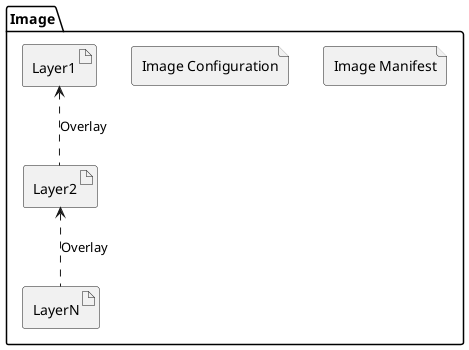
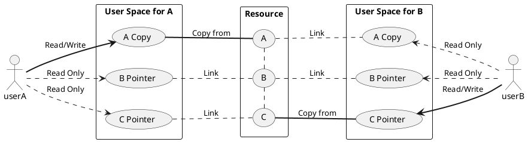

## Preface
We are now in the era of containerization, where hardly anyone in development, testing, or operations would be unfamiliar with or unable to use Docker. Using Docker is also straightforward; most of the time, launching a container simply involves executing `docker run {your-image-name}`, and building an image is as simple as executing `docker build dockerfile .`.   
Perhaps it's precisely because Docker encapsulates implementation details so thoroughly that I recently realized that we may have only learned **how to use Docker CLI**, rather than understanding how Docker actually operates.   
I will discuss the implementation details related to `docker run {your-image-name}` in the 『How To Run Container』 series. This article is the second in the series and will introduce the implementation details involved in creating a container from an image.

## What Are Images and Containers?
### 1. What is an Image?
As mentioned in my previous article [『Docker 镜像规范 v1.2』](/en/posts/2021/01/31/how-to-build-images-docker-%E9%95%9C%E5%83%8F%E8%A7%84%E8%8C%83.html), an `image` is an archive that **stores the history of changes made to a file system**. Generally, a image has the following directory structure:
```bash
.
├── 036a82c6d65f2fa43a13599661490be3fca1c3d6790814668d4e8c0213153b12
│   ├── VERSION
│   ├── json
│   └── layer.tar
├── f578fecf2875c8c4e4f88d15b90949fa40c71a0f0231b831f1263c708c2d524d
│   ├── VERSION
│   ├── json
│   └── layer.tar
├── 6ad733544a6317992a6fac4eb19fe1df577d4dec7529efec28a5bd0edad0fd30.json
├── manifest.json
└── repositories
```
When storing changes to the file system, an `image` defines **a history of changes to a set of file systems** as `「image layers」`. Each image layer is responsible for recording the differences between the file systems of that layer and the previous layer. The relationships between these image layers are maintained by an `image manifest`.

In summary, **an image can be understood simply as a file system composed of multiple image layers stacked on top of each other** (as shown in the diagram below).

> In fact, the image also contains some basic information, such as the creation date, author, the ID of its parent image, and relevant configurations for runtime. For a more detailed description of image content, please refer to my another article [『Docker Image Specification v1.2』](/en/posts/2021/01/31/how-to-build-images-docker-%E9%95%9C%E5%83%8F%E8%A7%84%E8%8C%83.html)

### 2. What is a Container?
According to the definition of OCI (Open Container Initiative), a `container` is a configurable environment used for **executing processes**, with **resource constraints** and **isolation**. We know that the **resource constraints** and **isolation** of `Linux containers` are implemented based on `Cgroups` and `Linux namespaces` respectively. Both are functionalities provided by the Linux kernel. Cgroups are used to restrict and isolate a group of processes' usage of system resources, while Linux namespaces encapsulate kernel resources (IPC, Network, Mount, PID, UTS, and User), ensuring that different processes operating on the same resource within their respective namespace do not affect processes in other namespaces.

The relationship between a `container` and an `image` is like that of a template and an instance. An image provides the **necessary elements (file system and runtime configuration)** to run a container, but a container can also run without depending on an image. In other words, we can consider an image as a **sufficient but not necessary condition** for a container to run.

> For more details on "sufficient but not necessary conditions," interested readers can refer to my previous article [『Guide you to build Docker image manually from scratch』](/en/posts/2021/04/01/how-to-build-image-%E4%BB%8E-0-%E5%BC%80%E5%A7%8B%E5%B8%A6%E4%BD%A0%E5%BE%92%E6%89%8B%E6%9E%84%E5%BB%BA-docker-%E9%95%9C%E5%83%8F.html#%E7%85%A7%E7%8C%AB%E7%94%BB%E8%99%8E-%E6%9E%84%E5%BB%BA%E5%8F%AF%E8%BF%90%E8%A1%8C%E7%9A%84%E5%AE%B9%E5%99%A8%E6%8D%86%E7%BB%91%E5%8C%85). In that article, I demonstrated **how to run a container using an image** and **how to build and run a container without relying on an image**.

## How does Docker create a container from an image?

As mentioned earlier, an `image` is an archive that stores the history of changes made to a file system, while a `container` is a configurable environment used for *executing processes* with **resource constraints** and **isolation**. Essentially, an image provides the file system and runtime parameter configuration for a container, and the container is an instance created from an image.

Next, we will delve into the implementation details of how Docker creates a container from an image.

### Image Storage and UnionFS
Docker's layered image storage design is inspired by *UnionFS*. *UnionFS* is a technology that can mount files and directories from multiple independent file systems into a unified file system, masking the underlying details.

Each image layer in a Docker image is an **incomplete** file system that records the differences between the file systems of that layer and the previous layer. This layered approach gives Docker lighter-weight images (compared to virtual machines), and distributing images only requires downloading the corresponding image layers.

However, this layered image design also introduces a challenge: **how to delete files from upper layers of an image?**

For this problem, Docker has directly adopted UnionFS's solution: `Whiteout` and `Opaque`.

#### Whiteout

The concepts of `Whiteout` and `Opaque Whiteout` are borrowed from the UnionFS protocol. In Docker images, by using a convention for file naming, the lower layer file system describes which files or directories from the upper layer file system need to be masked. For example, here's a basic layer containing multiple resources:

```bash
❯ tree .
.
└── a
    ├── b
    │   └── c
    │       ├── bar
    │       └── foo
    └── baz

3 directories, 3 files
```

If the file `a/b/c/foo` needs to be deleted from the lower layer file system, then the lower layer file system needs to create a hidden file named with `.wh.<filename>`. Therefore, the lower layer file system should have the following file system structure:

```bash {6}
❯ tree . -a
.
└── a
    └── b
        └── c
            └── .wh.foo

3 directories, 1 file
```

#### Opaque Whiteout
In addition to using `Whiteout` to describe the protocol for deleting individual files, it is also possible to use `Opaque Whiteout` to describe the deletion of all files within a particular directory.

Taking the basic file system mentioned earlier as an example, if the lower layer file system wants to delete all files within the `a` directory, then the lower layer file system needs to create a hidden file named `.wh..wh..opq` within the `a` directory. Therefore, the lower layer file system should have the following file system structure:
```bash {4}
❯ tree . -a
.
└── a
    └── .wh..wh..opq

1 directory, 1 file
```

Of course, we can achieve equivalent effects to `Opaque Whiteout` using `Whiteout` as well. For example, considering the basic file system mentioned earlier, if we want to delete all files within the `a` directory, we can also obtain equivalent results with the following file system structure:
```bash {4,5}
❯ tree . -a 
.
└── a
    ├── .wh.b
    └── .wh.baz

1 directory, 2 files
```
> It's worth noting that unlike `Opaque Whiteout`, if a new file or directory is added under the `a` directory, using `Whiteout` to delete all files in the `a` directory would require creating a new `Whiteout` hidden file for this new file or directory. However, when using `Opaque Whiteout`, this is not necessary.

### ReadOnly & Copy on Write
#### ReadOnly Layer
Docker has designed a storage solution for image content (file system change history) based on UnionFS, while imposing a restriction: **all image layers are read-only, and modifying the content of image layers is not allowed**.

This restriction not only prevents unexpected changes to container content during runtime^[1]^ but also makes container images lighter-weight compared to virtual machines.

> ^[1]^Consider this: if the content of the upper layer file system changes, does the union-mounted file system need to synchronize the changed content?

 

Based on Docker's excellent image design, each host only needs to store one copy of each image layer, and when distributing images, only the missing image layer content needs to be downloaded, greatly saving storage and network bandwidth.

Next, how do containers modify content in read-only image layers? This leads us to another technique: **Copy-on-Write**.

#### Copy-on-Write
**Copy-on-Write (also known as CoW)** is actually an optimization strategy in the field of computer program design. As the name suggests, when multiple users simultaneously request the same resource (such as data in memory or on disk), they initially obtain addresses pointing to the same resource. Only when one user attempts to modify the content of the resource will the system actually make a copy of an exclusive version for that user, while the resource accessed by other users remains unchanged.


Containers introduce Copy-on-Write (Cow) technology, which saves space and time overheads incurred by creating multiple complete copies through **lazy copying**. This technology manifests in containers by adding a read/write layer (R/W Layer) on top of UnionFS for each container. All content within this layer represents all file system changes for that container.
> With the help of Cow technology, when building images, it's only necessary to archive the read/write layer of each image layer.


## Hands-on: Creating a Container from an Image Using OverlayFS2
The process of starting a container using runc has been thoroughly demonstrated in the previous article [『从 0 开始带你徒手构建 Docker 镜像』](/en/posts/2021/04/01/how-to-build-image-%E4%BB%8E-0-%E5%BC%80%E5%A7%8B%E5%B8%A6%E4%BD%A0%E5%BE%92%E6%89%8B%E6%9E%84%E5%BB%BA-docker-%E9%95%9C%E5%83%8F.html). Here, let's review the process briefly. To directly run a container, it's quite simple:
1. Organize the container as a Filesystem Bundle.
2. Write correct configurations into `config.json`.
3. Populate `$root.path` with appropriate and available files.
4. Execute `runc run $containerid` to start the container.

However, unlike the previous article where we built Docker images from scratch, this time we will obtain the image from DockerHub, fully simulating the process involved in `docker run {your-image-name}`.

### 1. Obtaining the Image
We know that DockerHub can be accessed without Docker Engine, and its interface specification follows Docker Registry API V2. This means we only need to use the REST API to obtain images from DockerHub. Here, we'll use an open-source script [download-frozen-image-v2.sh](https://raw.githubusercontent.com/moby/moby/master/contrib/download-frozen-image-v2.sh). This script implements processes like `Token authentication`, `pulling image manifests`, and `pulling image layers` using tools like curl and jq. Below is a demonstration of how to use this script to pull the alpine/git:v2.30.2 image.

```bash {5,19,23,27,29,32,34}
❯ ./download-frozen-image-v2.sh -h
usage: ./download-frozen-image-v2.sh dir image[:tag][@digest] ...
       ./download-frozen-image-v2.sh /tmp/old-hello-world hello-world:latest@sha256:8be990ef2aeb16dbcb9271ddfe2610fa6658d13f6dfb8bc72074cc1ca36966a7

❯ ./download-frozen-image-v2.sh alpine alpine/git:v2.30.2
Downloading 'alpine/git:v2.30.2@v2.30.2' (3 layers)...
#=#=-  ##     #
############################################################################################################################################################################ 100.0%
#=#=-  ##     #
############################################################################################################################################################################ 100.0%
#=#=-  ##     #
############################################################################################################################################################################ 100.0%

Download of images into 'alpine' complete.
Use something like the following to load the result into a Docker daemon:
  tar -cC 'alpine' . | docker load

## 查看镜像结构
❯ tree alpine/
alpine/
├── 09af0b97aec5975955488d528e8535d2678b75cb29adb6827abd85b52802d1b1
│   ├── json
│   ├── layer.tar
│   └── VERSION
├── 86f68eb8bb2057574a5385c9ce7528b70632e1c750fb36d5ac76c0a5460f5d95
│   ├── json
│   ├── layer.tar
│   └── VERSION
├── b86cef5f7cf032b9793fe2a4fb18ddf606df8ea9e41d4c2086749bf943c2985b.json
├── d8aa90f099f0f17f3ad894f0909e6bfd026cc4c76eec03e3e50391af42f41976
│   ├── json
│   ├── layer.tar
│   └── VERSION
├── manifest.json
└── repositories

3 directories, 12 files
```

### 2. Building the Overlay File System
After obtaining the image, we can start organizing the image content into a Filesystem Bundle. Here, we'll follow the process outlined in the [Docker Overlay2 Driver](https://github.com/moby/moby/blob/master/daemon/graphdriver/overlay2/overlay.go) to construct the container's rootfs.
> OverlayFS is a modern union file system similar to AUFS but with faster performance and simpler implementation. It has been integrated into Linux kernel versions 3.8 and above and is recommended by Docker for use as the file system in production environments.

```bash
## Extracting the image content
### Determining the order of image layers
❯ cat alpine/manifest.json
[
  {
    "Config": "b86cef5f7cf032b9793fe2a4fb18ddf606df8ea9e41d4c2086749bf943c2985b.json",
    "RepoTags": [
      "alpine/git:v2.30.2"
    ],
    "Layers": [
      "86f68eb8bb2057574a5385c9ce7528b70632e1c750fb36d5ac76c0a5460f5d95/layer.tar",
      "09af0b97aec5975955488d528e8535d2678b75cb29adb6827abd85b52802d1b1/layer.tar",
      "d8aa90f099f0f17f3ad894f0909e6bfd026cc4c76eec03e3e50391af42f41976/layer.tar"
    ]
  }
]

### Creating directories for extracting image layers
❯ mkdir -p /tmp/overlay/image/1 /tmp/overlay/image/2 /tmp/overlay/image/3 

### Extracting the content of image layers and arranging them in order
❯ tar -C /tmp/overlay/image/1 -xf alpine/86f68eb8bb2057574a5385c9ce7528b70632e1c750fb36d5ac76c0a5460f5d95/layer.tar
❯ tar -C /tmp/overlay/image/2 -xf alpine/09af0b97aec5975955488d528e8535d2678b75cb29adb6827abd85b52802d1b1/layer.tar 
❯ tar -C /tmp/overlay/image/3 -xf alpine/d8aa90f099f0f17f3ad894f0909e6bfd026cc4c76eec03e3e50391af42f41976/layer.tar

## Building OverlayFS
### Creating mount points (empty directories)
❯ mkdir -p /tmp/overlay/container-a/merged /tmp/overlay/container-a/upperdir /tmp/overlay/container-a/workdir

### Mounting the image file system to the /tmp/overlay/container-a/merged directory, where the content of the read/write layer of the image is stored in /tmp/overlay/container-a/upperdir
❯ cd /tmp/overlay/ && \
  mount -t overlay overlay \
  -o lowerdir=image/1:image/2:image/3,upperdir=container-a/upperdir,workdir=container-a/workdir \
  /tmp/overlay/container-a/merged

## Verifying mount records
❯ mount |grep overlay
overlay on /tmp/overlay/container-a/merged type overlay (rw,relatime,lowerdir=image/1:image/2:image/3,upperdir=container-a/upperdir,workdir=container-a/workdir)

## Verifying that changes in the read/write layer do not affect the lower layer file system
❯ echo "1" > /tmp/overlay/container-a/merged/a

## Only the read/write layer (upperdir) will be written to
❯ cat /tmp/overlay/container-a/upperdir/a
1

## The lower layer file system (lowerdir) remains unchanged
❯ cat image/1/a
cat: image/1/a: No such file or directory
❯ cat image/2/a
cat: image/2/a: No such file or directory
❯ cat image/3/a
cat: image/3/a: No such file or directory

## However, modifying the lower layer file system after mounting will reflect in the mounted union file system
❯ echo "2" > image/1/b
❯ cat container-a/merged/b
2

## Then delete 'b' in the merged layer and check the content of the read/write layer
❯ rm container-a/merged/b && ls -ahl container-a/upperdir
总用量 8.0K
drwxr-xr-x 2 root root 4.0K 8月  12 17:08 .
drwxr-xr-x 5 root root 4.0K 8月  12 12:05 ..
c--------- 1 root root 0, 0 8月  12 17:08 b

## Verify that it does not affect the lower layer of the image file system
❯ cat image/1/b
2
```

### 3. Starting the Container
After successfully creating the container's file system from the image in steps 1 and 2, now all that's left is to start it using runc.

```bash
❯ cd /tmp/overlay/container-a/

## Create config.json
❯ runc spec

## Replace "rootfs" with "merged", setting the container's startup directory to merged
❯ sed -i "s/\"rootfs\"/\"merged\"/" config.json
## Disable readonly
❯ sed -i "s/\"readonly\": true/\"readonly\": false/" config.json

## Start the container!
❯ runc run container-a

## Try writing to a file
❯ echo "hello world" > container-a
❯ cat container-a
hello world

## Verify if the file was successfully written outside the container
❯ cat cat upperdir/container-a
hello world
```

### 4. Conclusion
In this article, we successfully created a container file system from an image and successfully started the container. Let's summarize the process:
0. Familiarize yourself with the Docker Registry API V2 specification and understand how to download images from DockerHub (optional, if you already have the image).
1. Understand the Docker image specification and how to convert images into file systems.
   - If the image shields content from lower layers of the file system, then understanding the different UnionFS implementations of the Whiteout protocol is necessary.
2. Familiarize yourself with the OCI runtime specification and understand how to start a container from a root file system.

## Conclusion
This article is the second installment of the 『How To Run Container』 series, focusing on Docker image design and introducing how Docker image layering design is inspired by Union FileSystem. Docker requires that the content of each layer in the image only increases but does not decrease at the top level. However, the upper layer file system can shield content from the lower layer file system using the `Whiteout protocol`. Furthermore, thanks to the `Copy-on-Write (COW)` technology, Docker allocates a writable layer for each container, ensuring that modifications to the image content by one container do not affect others. This writable layer also records all file system changes for the container. Finally, this article demonstrated how to construct a container root file system and start a container without relying on Docker Engine.

So far, we have covered most of the technologies involved in containerization. The next article in this series will delve into the Linux kernel to explore the details of **resource limitation** and **isolation** in container implementation.

Before that, however, I will be writing the third article in the "How To Build Images" series. In this upcoming article, I will delve into the interaction process between `Docker Daemon` and `Docker Registry`, dissecting the details behind `docker pull` and `docker push`.
