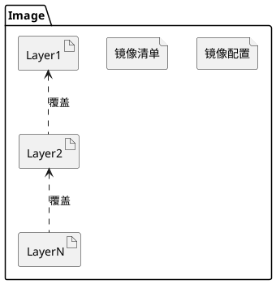
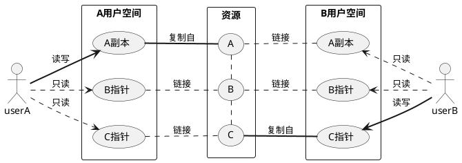

## 前言
现在是容器化时代，不管是开发、测试还是运维，很少有人会不知道或不会用 Docker。使用 Docker 也很简单，很多时候启动容器无非就是执行 `docker run {your-image-name}`，而构建镜像也就是执行一句 `docker build dockerfile .`的事情。   
也许正是由于 **Docker** 对实现细节封装得过于彻底，有时候会觉得我们也许只是学会了**如何使用`Docker CLI`** , 而并非明白 Docker 是如何运行的。  
笔者将在『How To Run Container』系列文章讲述 `docker run {your-image-name}` 相关的实现细节，本文是本系列的第二篇文章，将为各位介绍从镜像创建容器涉及到的实现细节。 

## 什么是镜像和容器？
### 1. 什么是镜像？
正如我上一篇文章[『Docker 镜像规范 v1.2』](/posts/2021/01/31/how-to-build-images-docker-%E9%95%9C%E5%83%8F%E8%A7%84%E8%8C%83.html)中指出的, `镜像`是一个**存储了文件系统发生的变更历史**的归档包。一般而言，一个基本的镜像具有以下的目录结构:
```bash
.
├── 036a82c6d65f2fa43a13599661490be3fca1c3d6790814668d4e8c0213153b12
│   ├── VERSION
│   ├── json
│   └── layer.tar
├── f578fecf2875c8c4e4f88d15b90949fa40c71a0f0231b831f1263c708c2d524d
│   ├── VERSION
│   ├── json
│   └── layer.tar
├── 6ad733544a6317992a6fac4eb19fe1df577d4dec7529efec28a5bd0edad0fd30.json
├── manifest.json
└── repositories
```

在存储文件系统发生的变更时, 镜像(Image) 将**一组文件系统的变更历史**定义为`「镜像层(Image Layer)」`, 每个镜像层负责记录该层镜像与上一层镜像的文件系统之间的差异, 而这些镜像层之间的关系则由`镜像清单(Image manifest)`负责维护。   
综上所述, **镜像可以简单地理解成由多个镜像层叠加起来的文件系统**。(如下图)

> 事实上, 镜像内还记录了该镜像的一些基本信息, 例如创建日期, 作者和其父镜像的ID, 以及运行时的相关配置, 关于镜像内容更详细的描述可参考我的另一篇文章[『Docker 镜像规范 v1.2』](/posts/2021/01/31/how-to-build-images-docker-%E9%95%9C%E5%83%8F%E8%A7%84%E8%8C%83.html)

### 2.什么是容器？
根据 OCI 的定义, `容器`是一个可配置**资源限制**和**隔离性**的, 用于**执行进程的环境**。我们知道, `Linux 容器`的**资源限制**和**隔离性**是分别基于 `Cgroup` 和 `Linux Namespace` 实现的, 两者都是 Linux 内核提供的功能, 其中 Cgroup 用于限制和隔离一组进程对系统资源的使用, 而 Linux Namespace 对内核资源(IPC、Network、Mount、PID、UTS 和 User)进行了封装, 使得不同进程在各自的 Namespace 下操作同一种资源时, 不会影响 Namespace 下的进程。  
`容器`和`镜像`的关系就像是模板和实例, 镜像提供了**运行容器的必要元素(文件系统和运行配置)**，但不依赖镜像也可运行容器, 简而言之, 我们可以认为**镜像是容器的充分不必要条件**。
> 关于“充分不必要条件”, 感兴趣的读者可以阅读我在上一篇文章[『从 0 开始带你徒手构建 Docker 镜像』](/posts/2021/04/01/how-to-build-image-%E4%BB%8E-0-%E5%BC%80%E5%A7%8B%E5%B8%A6%E4%BD%A0%E5%BE%92%E6%89%8B%E6%9E%84%E5%BB%BA-docker-%E9%95%9C%E5%83%8F.html#%E7%85%A7%E7%8C%AB%E7%94%BB%E8%99%8E-%E6%9E%84%E5%BB%BA%E5%8F%AF%E8%BF%90%E8%A1%8C%E7%9A%84%E5%AE%B9%E5%99%A8%E6%8D%86%E7%BB%91%E5%8C%85)。在这篇文章中, 我先后为大家展示了**如何使用镜像运行容器**和**如何在不依赖镜像的前提下, 构建容器运行要素并运行容器**。

## Docker 是如何从镜像创建容器？
正如前文所言, `镜像`是一个**存储了文件系统发生的变更历史**的归档包, 而`容器`是一个可配置**资源限制**和**隔离性**的, 用于**执行进程的环境**。从本质而言, 镜像为容器提供了文件系统和运行参数配置, 而容器则是从镜像创建出来的一个实例。   
接下来, 我们将深入探讨 Docker 从镜像创建出容器的实现细节。

### 镜像存储和 UnionFS
Docker 镜像分层的存储设计借鉴自 UnionFS。UnionFS 是一种可以将多个独立的文件系统中的文件和目录联合挂载, 形成一个统一的, 屏蔽底层细节的文件系统的技术。   
Docker 镜像中每个镜像层都是一个**不完整**的文件系统, 它记录该层镜像与上一层镜像的文件系统之间的差异。这种分层策略赋予了 Docker 更轻量的镜像(相对于虚拟机而言), 分发镜像时只需要下载对应的镜像层即可。   
当然, 这种分层镜像设计也引入了一个难题, **如何删除上层镜像的文件?**   
对于这个问题, Docker 也是原封不动地引入了 UnionFS 的解决方案: `Whiteout` 和` Opaque`。

#### Whiteout
所谓的 `Whiteout` 和` Opaque Whiteout` 是借鉴自 UnionFS 协议, Docker 镜像通过约定的文件命名方式, 描述了下层文件系统需要屏蔽上层文件系统中的哪些文件或目录。例如, 以下是包含多个资源的基础层:
```bash
❯ tree .
.
└── a
    ├── b
    │   └── c
    │       ├── bar
    │       └── foo
    └── baz

3 directories, 3 files
```
如果下层文件系统内需要删除 `a/b/c/foo` 这个文件, 那么下层文件系统则需要创建一个以 `.wh.<filename>` 为命名的隐藏文件, 即下层文件系统应当具有以下的文件系统结构:
```bash {6}
❯ tree . -a
.
└── a
    └── b
        └── c
            └── .wh.foo

3 directories, 1 file
```

#### Opaque Whiteout
除了通过 `Whiteout` 描述删除单个文件的协议外, 还可以通过 `Opaque Whiteout` 描述删除某个目录下的所有文件。   
以上面提到的基础文件系统为例, 如果下层文件系统希望删除 `a` 目录下的所有文件, 那么下层文件系统则需要在 `a` 目录下创建命名为 `.wh..wh..opq` 的隐藏文件, 即下层文件系统应当具有以下的文件系统结构:
```bash {4}
❯ tree . -a
.
└── a
    └── .wh..wh..opq

1 directory, 1 file
```
当然, 我们也可以通过 `Whiteout` 达到与 `Opaque Whiteout` 等价的效果, 例如以上面提到的基础文件系统为例, 我们希望删除 `a` 目录下的所有文件, 还可以采用以下的文件系统结构获得等价的结果:
```bash {4,5}
❯ tree . -a 
.
└── a
    ├── .wh.b
    └── .wh.baz

1 directory, 2 files
```
> 值得注入的是: 如 `Opaque Whiteout` 不同的是, 如果 `a` 目录下新增一个新的文件或目录, 那么通过 `Whiteout` 删除 `a` 目录下的所有文件则需要为这个新的文件或目录创建新的 `Whiteout` 隐藏文件, 而使用 `Opaque Whiteout` 则不需要。

### ReadOnly & Copy on Write
#### ReadOnly Layer
Docker 在 UnionFS 的基础上设计了镜像内容(文件系统变更历史)的存储方案, 同时又增加了一个限制: **所有镜像层只读, 不允许更改镜像层内容**。   
这个限制不但避免了容器内容在运行时出现意外变更<sup>注</sup>, 而且使得容器镜像比虚拟机而言更加轻量。
> 注: 试想下, 如果上层文件系统内容变更后, 联合挂载的文件系统是否需要同步变更内容？

 

基于 Docker 出色的镜像设计方案, 使得每台主机只需要为每个镜像层存储一个副本<sup>注</sup>, 同时在分发镜像时也只需下载缺失的镜像层内容, 这大大节省了存储和网络带宽。   
> 注: 是否所有

接下来, 那么容器如何在只读的镜像层增删内容呢？这就不得不介绍另一个技术: **Copy-on-Write**

#### Copy-on-Write
**Copy-on-Write(简称, Cow)** 实际上是一种计算机程序设计领域的优化策略, 顾名思义, 如果有多个用户同时请求相同的资源时(如内存或磁盘上的数据), 他们首先会获得指向相同资源的地址, 直到某个用户视图修改资源的内容时, 系统才会真正复制一份专属副本给该用户, 而其他用户所访问的资源仍然保持不变。  

容器引入Cow(🐂)技术, 通过**延迟拷贝**的方式节省了创建多个完整副本时带来的空间和时间上的开销。该技术在容器上则表现为每个容器在 UnionFS 的基础上增加了各自的读写层(R/W Layer), 该层中的所有内容即是该容器的所有文件系统变更<sup>注</sup>。
> 注: 借助 Cow 技术, 构建镜像时只需要将每层镜像的读写层归档成镜像层即可。


## 实战: 基于 OverlayFS2, 徒手从镜像创建容器
使用 runc 启动容器的流程已经在上一篇文章[『从 0 开始带你徒手构建 Docker 镜像』](/posts/2021/04/01/how-to-build-image-%E4%BB%8E-0-%E5%BC%80%E5%A7%8B%E5%B8%A6%E4%BD%A0%E5%BE%92%E6%89%8B%E6%9E%84%E5%BB%BA-docker-%E9%95%9C%E5%83%8F.html)充分演示, 这里重新回顾下流程, 想要直接运行容器十分简单, 只需要:
1. 将容器编排为文件系统捆绑包(Filesystem Bundle)的形式
2. 往 `config.json` 编写正确的配置
3. 往 `$root.path` 填充合理和可用的文件
4. 执行 runc run $containerid 启动容器

但是如上一篇文章不同的是, 我们这次不再是徒手构建 Docker 镜像, 而是从 DockerHub 中获取镜像，充分模拟 `docker run {your-image-name}` 涉及的流程。

### 1. 获取镜像
我们知道, DockerHub 并不需要 Docker Engine 即可访问, 其接口规范遵循 Docker Registry API V2。也就是说, 我们只需要使用 REST API 即可从 DockerHub 获取镜像。这里使用到一个开源脚本[download-frozen-image-v2.sh](https://raw.githubusercontent.com/moby/moby/master/contrib/download-frozen-image-v2.sh), 该脚本使用 curl, jq 等工具实现了`Token 认证`, `拉取镜像清单`, `拉取镜像层` 等流程, 下面演示如何使用该脚本拉取 alpine/git:v2.30.2 镜像

```bash {5,19,23,27,29,32,34}
❯ ./download-frozen-image-v2.sh -h
usage: ./download-frozen-image-v2.sh dir image[:tag][@digest] ...
       ./download-frozen-image-v2.sh /tmp/old-hello-world hello-world:latest@sha256:8be990ef2aeb16dbcb9271ddfe2610fa6658d13f6dfb8bc72074cc1ca36966a7

❯ ./download-frozen-image-v2.sh alpine alpine/git:v2.30.2
Downloading 'alpine/git:v2.30.2@v2.30.2' (3 layers)...
#=#=-  ##     #
############################################################################################################################################################################ 100.0%
#=#=-  ##     #
############################################################################################################################################################################ 100.0%
#=#=-  ##     #
############################################################################################################################################################################ 100.0%

Download of images into 'alpine' complete.
Use something like the following to load the result into a Docker daemon:
  tar -cC 'alpine' . | docker load

## 查看镜像结构
❯ tree alpine/
alpine/
├── 09af0b97aec5975955488d528e8535d2678b75cb29adb6827abd85b52802d1b1
│   ├── json
│   ├── layer.tar
│   └── VERSION
├── 86f68eb8bb2057574a5385c9ce7528b70632e1c750fb36d5ac76c0a5460f5d95
│   ├── json
│   ├── layer.tar
│   └── VERSION
├── b86cef5f7cf032b9793fe2a4fb18ddf606df8ea9e41d4c2086749bf943c2985b.json
├── d8aa90f099f0f17f3ad894f0909e6bfd026cc4c76eec03e3e50391af42f41976
│   ├── json
│   ├── layer.tar
│   └── VERSION
├── manifest.json
└── repositories

3 directories, 12 files
```

### 2. 构建 Overlay 文件系统
在获取到镜像之后, 我们则可以开始将镜像内容编排为文件系统捆绑包(Filesystem Bundle)的形式, 这里根据 [Docker Overlay2 Driver](https://github.com/moby/moby/blob/master/daemon/graphdriver/overlay2/overlay.go) 的流程来构建容器的 rootfs。
> OverlayFS 是一个与 AUFS 类似的但性能更快, 实现更简单的现代联合文件系统, 已集成至 linux 3.8 以上版本的内核，是 Docker 推荐使用在生产环境的文件系统。

```bash
## 解压缩镜像内容
### 确定镜像层顺序
❯ cat alpine/manifest.json
[
  {
    "Config": "b86cef5f7cf032b9793fe2a4fb18ddf606df8ea9e41d4c2086749bf943c2985b.json",
    "RepoTags": [
      "alpine/git:v2.30.2"
    ],
    "Layers": [
      "86f68eb8bb2057574a5385c9ce7528b70632e1c750fb36d5ac76c0a5460f5d95/layer.tar",
      "09af0b97aec5975955488d528e8535d2678b75cb29adb6827abd85b52802d1b1/layer.tar",
      "d8aa90f099f0f17f3ad894f0909e6bfd026cc4c76eec03e3e50391af42f41976/layer.tar"
    ]
  }
]

### 创建镜像层解压缩的目录
❯ mkdir -p /tmp/overlay/image/1 /tmp/overlay/image/2 /tmp/overlay/image/3 

### 解压镜像层内容, 并按顺序进行编排
❯ tar -C /tmp/overlay/image/1 -xf alpine/86f68eb8bb2057574a5385c9ce7528b70632e1c750fb36d5ac76c0a5460f5d95/layer.tar
❯ tar -C /tmp/overlay/image/2 -xf alpine/09af0b97aec5975955488d528e8535d2678b75cb29adb6827abd85b52802d1b1/layer.tar 
❯ tar -C /tmp/overlay/image/3 -xf alpine/d8aa90f099f0f17f3ad894f0909e6bfd026cc4c76eec03e3e50391af42f41976/layer.tar

## 构建 OverlayFS
### 创建挂载点(空目录)
❯ mkdir -p /tmp/overlay/container-a/merged /tmp/overlay/container-a/upperdir /tmp/overlay/container-a/workdir

### 挂载镜像文件系统至 /tmp/overlay/container-a/merged 目录, 其中镜像的读写层内容存储在 /tmp/overlay/container-a/upperdir
❯ cd /tmp/overlay/ && \
  mount -t overlay overlay \
  -o lowerdir=image/1:image/2:image/3,upperdir=container-a/upperdir,workdir=container-a/workdir \
  /tmp/overlay/container-a/merged

## 验证挂载记录
❯ mount |grep overlay
overlay on /tmp/overlay/container-a/merged type overlay (rw,relatime,lowerdir=image/1:image/2:image/3,upperdir=container-a/upperdir,workdir=container-a/workdir)

## 验证读写层不会影响底层文件系统
❯ echo "1" > /tmp/overlay/container-a/merged/a

## 只有读写层(upperdir)会被写入
❯ cat /tmp/overlay/container-a/upperdir/a
1

## 底层文件系统(lowerdir)不会被修改
❯ cat image/1/a
cat: image/1/a: No such file or directory
❯ cat image/2/a
cat: image/2/a: No such file or directory
❯ cat image/3/a
cat: image/3/a: No such file or directory

## 但是, 挂载后修改底层文件系统则会体现到挂载的联合文件系统之中
❯ echo "2" > image/1/b
❯ cat container-a/merged/b
2

## 然后在 merged 层中删除 b, 再查看读写层的内容
❯ rm container-a/merged/b && ls -ahl container-a/upperdir
总用量 8.0K
drwxr-xr-x 2 root root 4.0K 8月  12 17:08 .
drwxr-xr-x 5 root root 4.0K 8月  12 12:05 ..
c--------- 1 root root 0, 0 8月  12 17:08 b

## 验证并不影响底层的镜像文件系统
❯ cat image/1/b
2
```

### 3. 启动容器
在步骤 1,2 中以成功从镜像创建出容器的文件系统, 现在只需要使用 runc 启动即可。

```bash
❯ cd /tmp/overlay/container-a/

## 创建 config.json
❯ runc spec

## 将 "rootfs" 替换成 "merged", 即设置容器的启动目录在 merged
❯ sed -i "s/\"rootfs\"/\"merged\"/" config.json
## 取消 readonly
❯ sed -i "s/\"readonly\": true/\"readonly\": false/" config.json

## 启动！
❯ runc run container-a

## 尝试写入文件
❯ echo "hello world" > container-a
❯ cat container-a
hello world

## 容器外验证文件是否写入成功
❯ cat cat upperdir/container-a
hello world
```

### 4. 小结
到这里我们成功从镜像创建出容器的文件系统, 并成功启动容器, 最后我们总结一下, 从镜像创建容器十分简单, 只需要:
0. 熟悉 Docker Registry API V2 规范, 了解如何从 DocerHub 下载镜像(可选, 如果已有镜像则不需要)
1. 熟悉 Docker 镜像规范, 了解如何从镜像转换成文件系统
  - 如果镜像内屏蔽下层文件系统中的内容, 那么还需要了解不同 UnionFS 实现 Whiteout 的方式
2. 熟悉 OCI 运行时规范, 了解如何从根文件系统启动容器

## 总结
这篇文章是『How To Run Container』系列的第二篇，主要以 Docker 镜像设计为切入点, 介绍了 Docker 镜像分层设计是借鉴于 Union FileSystem。Docker 在顶层设计上要求镜像中每层的内容只增不删, 但上层文件系统可借助 `Whiteout 协议` 屏蔽下层文件系统中的内容。同时, 得益于 `Copy-on-Write(写入时复制)` 技术, Docker 为每个容器分配了各自的可读写的层, 使得容器对镜像内容的修改互不干扰, 而这容器读写层亦记录了该容器的所有文件系统变更。最后, 这篇文章还演示了在不依赖 Docker Engine 的前提下, 如何从镜像构造出容器根文件系统并启动容器。   
到目前为止, 我们已基本掌握容器化技术涉及到的所有技术, 本系列的下一篇文章将带大家深入 Linux 内核, 探索容器实现**资源限制**和**隔离性**的细节。   
但在此之前, 笔者将先编写『How To Build Images』系列的第三篇文章, 在未来的这篇文章中将与大家深入探讨 `Docker Daemon` 与 `Docker Registry` 的交互流程, 为大家剖析隐藏在 `docker pull` 与 `docker push` 背后的细节。