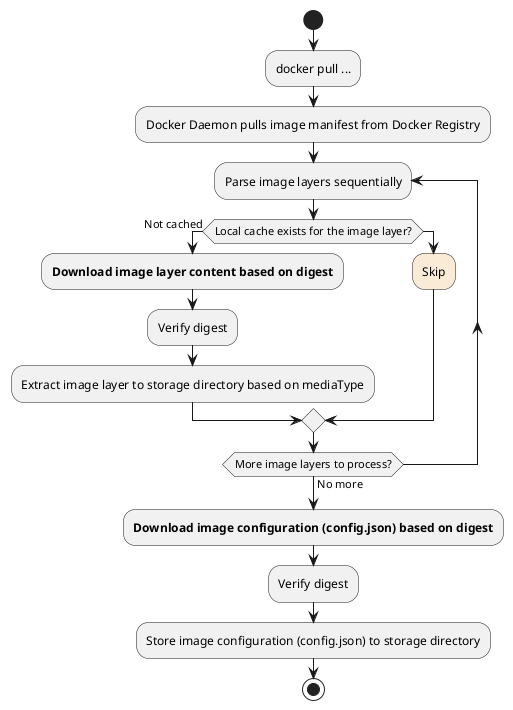
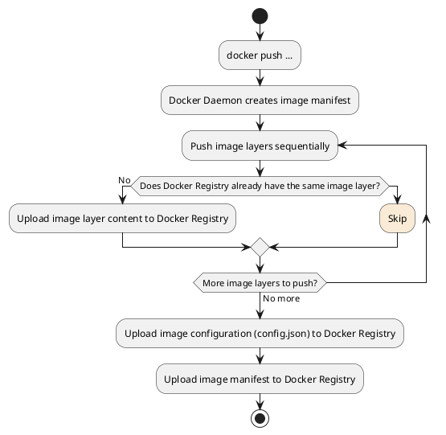

## Preface
We are now in the era of containerization, where hardly anyone in development, testing, or operations would be unfamiliar with or unable to use Docker. Using Docker is also straightforward; most of the time, launching a container simply involves executing `docker run {your-image-name}`, and building an image is as simple as executing `docker build dockerfile .`.   
Perhaps it's precisely because Docker encapsulates implementation details so thoroughly that I recently realized that we may have only learned **how to use Docker CLI**, rather than understanding how Docker actually operates.  
I will discuss the implementation details related to `Docker build dockerfile .` in the 『How To Build Image』 series. This article is the second in the series and will introduce the implementation details involved in creating a container from an image. This article is the third installment of the series and will introduce the interaction process and implementation details between `Docker Daemon` and `Docker Registry`.

## Relationship between Docker Daemon and Docker Registry
The command we commonly use, `docker`, is referred to as `Docker CLI`. `Docker CLI` provides users with commands to operate images, containers, networks, and volumes in the command line. However, the process that actually interacts with the corresponding resource entities is `Docker Daemon`.

`Docker` follows a typical client/server architecture, where `Docker Daemon` serves as the backend service component, responsible for managing all Docker resources on the host machine and communicating with other daemons.

`Docker Registry` is responsible for storing and distributing Docker images. When we invoke `docker pull` and `docker push`, `Docker Daemon` retrieves images from or pushes images to `Docker Registry`.


## Process of Docker Daemon Pulling Images
As mentioned earlier, when executing `docker pull` in the command line, it essentially instructs `Docker Daemon` to pull the required image from `Docker Registry`. In my previous article titled [『Guide you to build Docker image manually from scratch』](/en/posts/2021/04/01/how-to-build-image-%E4%BB%8E-0-%E5%BC%80%E5%A7%8B%E5%B8%A6%E4%BD%A0%E5%BE%92%E6%89%8B%E6%9E%84%E5%BB%BA-docker-%E9%95%9C%E5%83%8F.html#%E5%BD%92%E6%A1%A3%E5%B0%81%E5%8C%85) the process of building images was demonstrated. Is an image simply an archive package containing `config.json` (image configuration), `manifest.json` (image manifest), and `layer.tar` (image layer content)?

The answer is *NO*. When distributing images, Docker Registry distributes them based on image layers rather than directly distributing the image itself.

However, this introduces another issue. As described in my another article titled [『Docker Image Specification v1.2』](/en/posts/2021/01/31/how-to-build-images-docker-%E9%95%9C%E5%83%8F%E8%A7%84%E8%8C%83.html) images are organized based on a certain directory structure. If distribution is based on image layers, how does `Docker Daemon` know where to download each image layer from?

To solve this issue, another concept needs to be introduced: `Docker Image Manifest`.

### Docker Image Manifest
The `Docker Image Manifest` is different from `manifest.json`. The former is a manifest file used to describe images in the Docker Registry, while the latter is a manifest file describing the contents exported from an image.

Currently, Docker Registry supports two different formats of `Docker Image Manifest`: [Image Manifest Version 2, Schema 1](https://github.com/distribution/distribution/blob/main/docs/spec/manifest-v2-1.md) and [Image Manifest Version 2, Schema 2](https://github.com/distribution/distribution/blob/main/docs/spec/manifest-v2-2.md).

Below is an example of a manifest in Schema 2 format:
```json
{
    "schemaVersion": 2,
    "mediaType": "application/vnd.docker.distribution.manifest.v2+json",
    "config": {
        "mediaType": "application/vnd.docker.container.image.v1+json",
        "size": 7023,
        "digest": "sha256:b5b2b2c507a0944348e0303114d8d93aaaa081732b86451d9bce1f432a537bc7"
    },
    "layers": [
        {
            "mediaType": "application/vnd.docker.image.rootfs.diff.tar.gzip",
            "size": 32654,
            "digest": "sha256:e692418e4cbaf90ca69d05a66403747baa33ee08806650b51fab815ad7fc331f"
        },
        {
            "mediaType": "application/vnd.docker.image.rootfs.diff.tar.gzip",
            "size": 16724,
            "digest": "sha256:3c3a4604a545cdc127456d94e421cd355bca5b528f4a9c1905b15da2eb4a4c6b"
        },
        {
            "mediaType": "application/vnd.docker.image.rootfs.diff.tar.gzip",
            "size": 73109,
            "digest": "sha256:ec4b8955958665577945c89419d1af06b5f7636b4ac3da7f12184802ad867736"
        }
    ]
}
```
::: tip
It is worth noting that the corresponding type of **application/vnd.docker.container.image.v1+json** is the `Config` in [『Docker Image Specification v1.2』](/en/posts/2021/01/31/how-to-build-images-docker-%E9%95%9C%E5%83%8F%E8%A7%84%E8%8C%83.html) (also known as `Image JSON `).
:::

### Summary of Process

The `Docker Registry` uses **digests** to locate image layers and image configurations. The `Docker Image Manifest` describes the digests of image configurations and image layers, as well as their corresponding file types. Finally, the `Docker Daemon` only needs to download and parse the manifest one by one.

In summary, the process of `docker pull` can be outlined as follows:



## Docker Daemon Image Push Process

The workflow for pushing images is completely opposite to pulling images. The `Docker Daemon` first creates an image manifest. Then, it needs to push all image layers to the `Docker Registry`. Only when all image layers are completely pushed to the image repository, the image configuration is uploaded to the image repository. Finally, the image manifest is pushed. The process of `docker push` can be outlined as follows:



## An Essential Step Beyond the Process: User Authentication

So far, we have fully demonstrated the operation process of pulling and pushing images. However, there is another crucial step that has not yet been introduced, and that is **user authentication**.

Docker Registry implements user identity authentication using a central authentication service. The specific authentication process is illustrated as follows:


1. `Docker Daemon` attempts to perform pull/push operations.
2. If `Docker Registry` requires user authentication, it should return an `HTTP 401 Unauthorized` response, along with a description of how to authenticate the user in the response headers (based on the WWW-Authenticate protocol).
3. `Docker Daemon` authenticates the user with the central authentication service.
4. The central authentication service returns a `Bearer token` to `Docker Daemon`, representing the user's identity.
5. `Docker Daemon` retries the request sent in **Step 1**, including the `Bearer token` returned in **Step 4** in the request header.
6. `Docker Registry` authenticates the `Bearer token` included in the request header. Once verified, it responds normally.

## Getting Started
In the previous article, [『Guide you to build Docker image manually from scratch』](/en/posts/2021/04/01/how-to-build-image-%E4%BB%8E-0-%E5%BC%80%E5%A7%8B%E5%B8%A6%E4%BD%A0%E5%BE%92%E6%89%8B%E6%9E%84%E5%BB%BA-docker-%E9%95%9C%E5%83%8F.html#%E5%BD%92%E6%A1%A3%E5%B0%81%E5%8C%85), I demonstrated how to build a runnable image from scratch』. Now, let's try pushing that image to the official Docker Registry -- DockerHub.

### 1. Create Docker Image Manifest
Following the process outlined in the previous article, rebuild the image. After calculating the sha256 digest of both the `image configuration (config.json)` and the `image layer (layer.tar)`, you can write the `Docker Image Manifest`. The resulting JSON file will look like this:
```json
{
    "schemaVersion": 2,
    "mediaType": "application/vnd.docker.distribution.manifest.v2+json",
    "config": {
        "mediaType": "application/vnd.docker.container.image.v1+json",
        "size": 546,
        "digest": "sha256:2bd297f395ef7193402fbf58b1010655c7bf27b22c38545a63c71af402f73dc5"
    },
    "layers": [
        {
            "mediaType": "application/vnd.docker.image.rootfs.diff.tar.gzip",
            "size": 10240,
            "digest": "sha256:cc668e407245ebdacbb7ac6d5ead798556adb5aebfcdd7fa2ca777bed3a83fed"
        }
    ]
}
```

### 2. Upload Image Layers and Image Configuration to Docker Registry

According to the [API documentation](https://github.com/distribution/distribution/blob/main/docs/spec/api.md#monolithic-upload), we will use the monolithic upload method to push the image layers and image configuration to the Docker Registry.

```bash
## Environment variables involved:
## - your_username: Your DockerHub account username
## - your_password: Password for your DockerHub account
## - your_token: Token or access_token returned from the authentication endpoint

## [User Authentication] Initiate the upload of image configuration
➜ curl -X POST "https://registry.hub.docker.com/v2/${your_username}/runc-hello/blobs/uploads/" -v

## HTTP 401 Unauthorized
## < HTTP/1.1 401 Unauthorized
## < docker-distribution-api-version: registry/2.0
## < www-authenticate: Bearer realm="https://auth.docker.io/token",service="registry.docker.io",scope="repository:${your_username}/runc-hello:pull,push"

## [User Authentication] Perform user authentication
➜ curl -u "${your_username}:${your_password}" "https://auth.docker.io/token?service=registry.docker.io&scope=repository:${your_username}/runc-hello:pull,push"
## {
##  "token": "...",
##  "access_token": "...",
##  "expires_in": 300,
##  "issued_at": "2021-12-07T01:50:05.654533932Z"
## }

## [Upload image configuration] Reinitiate the upload image configuration operation
➜ curl -H "Authorization: Bearer ${your_token}" -X POST "https://registry.hub.docker.com/v2/${your_username}/runc-hello/blobs/uploads/" -v
## < HTTP/1.1 202 Accepted
## < content-length: 0
## < docker-distribution-api-version: registry/2.0
## < docker-upload-uuid: 53231064-74b5-48d5-8cbd-5f810fa99a0c
## < location: https://registry.hub.docker.com/v2/435495971/runc-hello/blobs/uploads/53231064-74b5-48d5-8cbd-5f810fa99a0c?_state=S8Kt2Fx6i-CX-C7j4kS9RahBhxtS5BySKuJoaKup6QJ7Ik5hbWUiOiI0MzU0OTU5NzEvcnVuYy1oZWxsbyIsIlVVSUQiOiI1MzIzMTA2NC03NGI1LTQ4ZDUtOGNiZC01ZjgxMGZhOTlhMGMiLCJPZmZzZXQiOjAsIlN0YXJ0ZWRBdCI6IjIwMjEtMTItMDdUMDI6NDE6MjEuODgwMDcwOTI5WiJ9

## [Upload image configuration] Start uploading image configuration content
➜ curl -H "Authorization: Bearer ${your_token}" -X PUT "https://registry.hub.docker.com/v2/${your_username}/runc-hello/blobs/uploads/53231064-74b5-48d5-8cbd-5f810fa99a0c?_state=S8Kt2Fx6i-CX-C7j4kS9RahBhxtS5BySKuJoaKup6QJ7Ik5hbWUiOiI0MzU0OTU5NzEvcnVuYy1oZWxsbyIsIlVVSUQiOiI1MzIzMTA2NC03NGI1LTQ4ZDUtOGNiZC01ZjgxMGZhOTlhMGMiLCJPZmZzZXQiOjAsIlN0YXJ0ZWRBdCI6IjIwMjEtMTItMDdUMDI6NDE6MjEuODgwMDcwOTI5WiJ9&digest=sha256:2bd297f395ef7193402fbf58b1010655c7bf27b22c38545a63c71af402f73dc5" --upload-file config.json -v
## Successful, HTTP 201
## < HTTP/1.1 201 Created
## < content-length: 0
## < docker-content-digest: sha256:2bd297f395ef7193402fbf58b1010655c7bf27b22c38545a63c71af402f73dc5


## [Upload image layer] Initiate the upload image layer request
➜ curl -H "Authorization: Bearer ${your_token}" -X POST "https://registry.hub.docker.com/v2/${your_username}/runc-hello/blobs/uploads/" -v
## < HTTP/1.1 202 Accepted
## < content-length: 0
## < docker-distribution-api-version: registry/2.0
## < docker-upload-uuid: 34efca43-27ed-4806-a74e-6cbea2d222f2
## < location: https://registry.hub.docker.com/v2/435495971/runc-hello/blobs/uploads/34efca43-27ed-4806-a74e-6cbea2d222f2?_state=O7lkfqKiEF-Ryqhms-_CnCsmd76kDtt_HjuprAebwJN7Ik5hbWUiOiI0MzU0OTU5NzEvcnVuYy1oZWxsbyIsIlVVSUQiOiIzNGVmY2E0My0yN2VkLTQ4MDYtYTc0ZS02Y2JlYTJkMjIyZjIiLCJPZmZzZXQiOjAsIlN0YXJ0ZWRBdCI6IjIwMjEtMTItMDdUMDI6NDY6MzEuNTY2ODMwNjI3WiJ9

## [Upload image layer] Start uploading image layer content
➜ curl -H "Authorization: Bearer ${your_token}" -X PUT "https://registry.hub.docker.com/v2/${your_username}/runc-hello/blobs/uploads/34efca43-27ed-4806-a74e-6cbea2d222f2?_state=O7lkfqKiEF-Ryqhms-_CnCsmd76kDtt_HjuprAebwJN7Ik5hbWUiOiI0MzU0OTU5NzEvcnVuYy1oZWxsbyIsIlVVSUQiOiIzNGVmY2E0My0yN2VkLTQ4MDYtYTc0ZS02Y2JlYTJkMjIyZjIiLCJPZmZzZXQiOjAsIlN0YXJ0ZWRBdCI6IjIwMjEtMTItMDdUMDI6NDY6MzEuNTY2ODMwNjI3WiJ9&digest=sha256:cc668e407245ebdacbb7ac6d5ead798556adb5aebfcdd7fa2ca777bed3a83fed" --upload-file layer.tar -v
## Successful, HTTP 201
## < HTTP/1.1 201 Created
## < content-length: 0
## < docker-content-digest: sha256:cc668e407245ebdacbb7ac6d5ead798556adb5aebfcdd7fa2ca777bed3a83fed
## < docker-distribution-api-version: registry/2.0
## < location: https://registry.hub.docker.com/v2/${your_username}/runc-hello/blobs/sha256:cc668e407245ebdacbb7ac6d5ead798556adb5aebfcdd7fa2ca777bed3a83fed
```

### 3. Upload image list
The example in Docker's official documentation uses Manifest Schema 1, which contains very complex content, but in fact, Schema 2 can also be used to create an image manifest.

```bash
➜ curl -H "Authorization: Bearer ${your_token}" -X PUT "https://registry.hub.docker.com/v2/${your_username}/runc-hello/manifests/latest" -H "Content-Type: application/vnd.docker.distribution.manifest.v2+json" -v -d '{
    "schemaVersion": 2,
    "mediaType": "application/vnd.docker.distribution.manifest.v2+json",
    "config": {
        "mediaType": "application/vnd.docker.container.image.v1+json",
        "size": 546,
        "digest": "sha256:2bd297f395ef7193402fbf58b1010655c7bf27b22c38545a63c71af402f73dc5"
    },
    "layers": [
        {
            "mediaType": "application/vnd.docker.image.rootfs.diff.tar.gzip",
            "size": 10240,
            "digest": "sha256:cc668e407245ebdacbb7ac6d5ead798556adb5aebfcdd7fa2ca777bed3a83fed"
        }
    ]
}'
## Successful, HTTP 201
## < HTTP/1.1 201 Created
## < docker-content-digest: sha256:c4c42af74cf13c704100d9a7583d106d90f737ffb7dc12593022884986fc41dc
## < docker-distribution-api-version: registry/2.0
## < location: https://registry.hub.docker.com/v2/${your_username}/runc-hello/manifests/sha256:c4c42af74cf13c704100d9a7583d106d90f737ffb7dc12593022884986fc41dc
```

### 4. Verify

```bash
➜ docker pull 435495971/runc-hello:latest
## latest: Pulling from 435495971/runc-hello
## cc668e407245: Pull complete
## Digest: sha256:c4c42af74cf13c704100d9a7583d106d90f737ffb7dc12593022884986fc41dc
## Status: Downloaded newer image for 435495971/runc-hello:latest
## docker.io/435495971/runc-hello:latest

➜ docker run --rm 435495971/runc-hello:latest
Hello runc!
```

## Conclusion
This article is the third installment of the 『How To Build Images』 series. It begins by introducing the relationship between `Docker Daemon` and `Docker Registry`. It then provides a detailed explanation of the hidden operations behind `docker pull` and `docker push`. Finally, using the example of building a runnable image from the previous article [『Guide you to build Docker image manually from scratch』](/en/posts/2021/04/01/how-to-build-image-%E4%BB%8E-0-%E5%BC%80%E5%A7%8B%E5%B8%A6%E4%BD%A0%E5%BE%92%E6%89%8B%E6%9E%84%E5%BB%BA-docker-%E9%95%9C%E5%83%8F.html#%E5%BD%92%E6%A1%A3%E5%B0%81%E5%8C%85), it fully demonstrates the steps to push an image to DockerHub. 

Up to this point, we have mastered the basic knowledge of image distribution and uploading. The next article in this series will delve into the hidden details behind `docker build dockerfile .` and will also introduce Google's solution for building images within containers, known as kaniko.

## Appendix
### Step-by-Step Guide to Pulling Images from Docker Registry
Due to space constraints, the 「Getting Started」 section of the main text only demonstrated the process of pushing images. Here, we continue to explore the steps involved in pulling images.

#### 1. Downloading Image Manifest
When downloading the image manifest, Docker Registry defaults to returning `Schema 1`. If you wish to receive the `Schema 2` version of the manifest, you need to specify `Accept: application/vnd.docker.distribution.manifest.v2+json`.

```bash
➜ curl -H "Accept: application/vnd.docker.distribution.manifest.v2+json" -H "Authorization: Bearer ${your_token}" "https://registry.hub.docker.com/v2/${your_username}/runc-hello/manifests/latest"
## {
##     "schemaVersion": 2,
##     "mediaType": "application/vnd.docker.distribution.manifest.v2+json",
##     "config": {
##         "mediaType": "application/vnd.docker.container.image.v1+json",
##         "size": 546,
##         "digest": "sha256:2bd297f395ef7193402fbf58b1010655c7bf27b22c38545a63c71af402f73dc5"
##     },
##     "layers": [
##         {
##             "mediaType": "application/vnd.docker.image.rootfs.diff.tar.gzip",
##             "size": 10240,
##             "digest": "sha256:cc668e407245ebdacbb7ac6d5ead798556adb5aebfcdd7fa2ca777bed3a83fed"
##         }
##     ]
## }
```

#### 2. Downloading Image Configuration and Image Layers
```bash
## Download the image configuration
➜ curl -H "Authorization: Bearer ${your_token}" "https://registry.hub.docker.com/v2/${your_username}/runc-hello/blobs/sha256:2bd297f395ef7193402fbf58b1010655c7bf27b22c38545a63c71af402f73dc5" -o 2bd297f395ef7193402fbf58b1010655c7bf27b22c38545a63c71af402f73dc5 -L

## Verify the image configuration
➜ cat 2bd297f395ef7193402fbf58b1010655c7bf27b22c38545a63c71af402f73dc5
{"architecture":"amd64","config":{"User":"","Tty":false,"Env":["PATH=/usr/local/sbin:/usr/local/bin:/usr/sbin:/usr/bin:/sbin:/bin"],"Cmd":["/hello"],"Volumes":null,"WorkingDir":"/","Entrypoint":null,"Labels":null},"created":"1970-01-01T00:00:00.0Z","docker_version":"20.10.5","history":[{"created":"1970-01-01T00:00:00.0Z","created_by":"nasm hello.nasm -f elf64 -o hello.o && ld hello.o -o hello && cp hello /hello"}],"os":"linux","rootfs":{"type":"layers","diff_ids":["sha256:cc668e407245ebdacbb7ac6d5ead798556adb5aebfcdd7fa2ca777bed3a83fed"]}}

## Download the image layers
➜ curl -H "Authorization: Bearer ${your_token}" "https://registry.hub.docker.com/v2/${your_username}/runc-hello/blobs/sha256:cc668e407245ebdacbb7ac6d5ead798556adb5aebfcdd7fa2ca777bed3a83fed" -o cc668e407245ebdacbb7ac6d5ead798556adb5aebfcdd7fa2ca777bed3a83fed -L

## Verify the image layers
➜ tar -tf cc668e407245ebdacbb7ac6d5ead798556adb5aebfcdd7fa2ca777bed3a83fed
hello
```

#### 3. Storing Images in Specific Directories
Although the Docker Registry interface is simple, the Docker Daemon itself needs to store the corresponding files in specific directories. The specific process includes:
- Storing the image configuration in the `graph` directory under `image/${storage_driver}/imagedb/content/sha256/`.
- Extracting the contents of the image layers into the `graph` directory under `${storage_driver}/${cache_id}`.
- Storing the image layer records in the `graph` directory under `image/${storage_driver}/layerdb/content/sha256/`.
- Recording the association between images and tags in the `graph` directory under `image/${storage_driver}/repositories.json`.

The following demonstrates the corresponding operations:
```bash
## Extract the current graph path
➜ graph=`docker info|grep -Eo "Docker Root Dir: .*" | sed -r "s/Docker Root Dir: (.*)/\1/g"`

## Extract Storage Driver Type
➜ storage_driver=`docker info|grep -Eo "Storage Driver: .*" | sed -r "s/Storage Driver: (.*)/\1/g"`

## Storage mirroring configuration
➜ cp 2bd297f395ef7193402fbf58b1010655c7bf27b22c38545a63c71af402f73dc5 "${graph}/image/${storage_driver}/imagedb/content/sha256/2bd297f395ef7193402fbf58b1010655c7bf27b22c38545a63c71af402f73dc5"

## Build image layer content
### 1. generate random cache-id
➜ cache_id=`cat /proc/sys/kernel/random/uuid | md5sum | awk '{print $1}'`
### 2. Create mapping directory
➜ mkdir -p "${graph}/${storage_driver}/${cache_id}"
➜ touch "${graph}/${storage_driver}/${cache_id}/committed"
➜ mkdir "${graph}/${storage_driver}/${cache_id}/diff"
### 3. Unzip the image layer to the diff directory
➜ tar -xf cc668e407245ebdacbb7ac6d5ead798556adb5aebfcdd7fa2ca777bed3a83fed -C "${graph}/${storage_driver}/${cache_id}/diff"
### 4. generate short ID (26 bits long)
➜ lid=`cat /proc/sys/kernel/random/uuid | md5sum | awk '{print substr($1,0,27)}'`
### 5. Create layer mapping
➜ ln -s "../${cache_id}/diff" "${graph}/${storage_driver}/l/${lid}" 
### 6. set short shasum id
➜ echo -n "$lid" > "${graph}/${storage_driver}/${cache_id}/link"


## Build image layer content (index)
➜ mkdir -p "${graph}/image/${storage_driver}/layerdb/sha256/cc668e407245ebdacbb7ac6d5ead798556adb5aebfcdd7fa2ca777bed3a83fed"
### 1. set diff-id
➜ echo -n "sha256:cc668e407245ebdacbb7ac6d5ead798556adb5aebfcdd7fa2ca777bed3a83fed" > "${graph}/image/${storage_driver}/layerdb/sha256/cc668e407245ebdacbb7ac6d5ead798556adb5aebfcdd7fa2ca777bed3a83fed/diff"
### 2. set image layer size
➜ echo -n `stat "${graph}/${storage_driver}/${cache_id}/diff/hello" --printf '%s'` > "${graph}/image/${storage_driver}/layerdb/sha256/cc668e407245ebdacbb7ac6d5ead798556adb5aebfcdd7fa2ca777bed3a83fed/size"
### 3. set short shasum id
➜ echo -n "${cache_id}" > "${graph}/image/${storage_driver}/layerdb/sha256/cc668e407245ebdacbb7ac6d5ead798556adb5aebfcdd7fa2ca777bed3a83fed/cache-id"

## set image index
➜ python -c "import json;fh=open('${graph}/image/${storage_driver}/repositories.json');repositories=json.load(fh);repositories['Repositories']['hello-runc']={'hello-runc:latest': 'sha256:2bd297f395ef7193402fbf58b1010655c7bf27b22c38545a63c71af402f73dc5'};print(repositories);fh=open('${graph}/image/${storage_driver}/repositories.json', mode='w');json.dump(repositories, fh);"
```

#### 4. Verify
```bash
## Only by restarting the Docker Daemon process will the image be correctly recognized.
➜ docker images
REPOSITORY   TAG       IMAGE ID   CREATED   SIZE

## Restart Docker Daemon
➜ systemctl restart docker

➜ docker images
REPOSITORY   TAG       IMAGE ID       CREATED        SIZE
hello-runc   latest    2bd297f395ef   51 years ago   1.02kB

➜ docker run --rm hello-runc
Hello runc!
```
